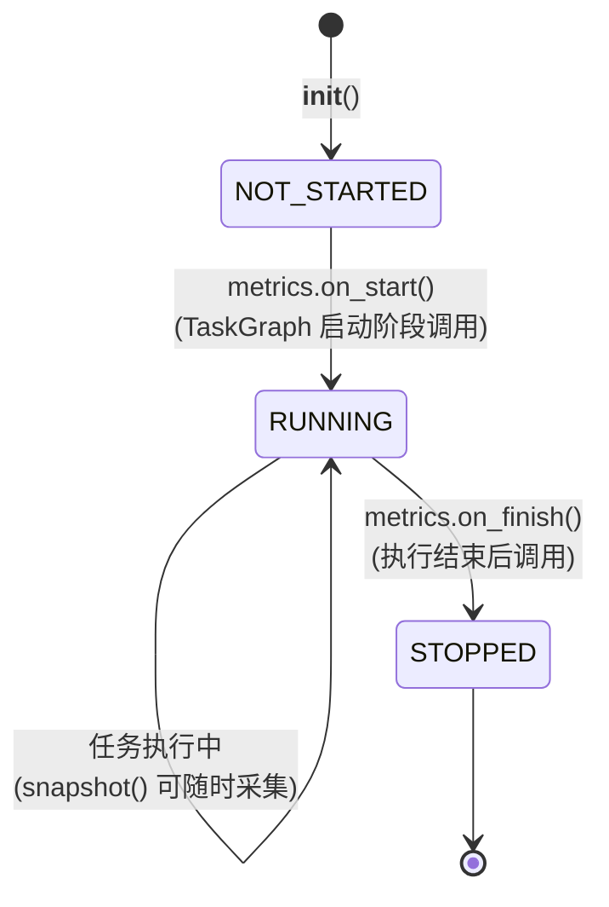

# TaskStage

> 📅 最后更新日期: 2026/08/26

`TaskStage` 是构建 `TaskGraph` 的基本单元。它继承自 `TaskExecutor`，并增加了图结构相关的连接能力。

> 注意：`TaskStage` 也是一次性对象。它通常由 `TaskGraph` 管理并参与一次完整运行；运行结束后，其队列绑定、计数状态和图内关联关系不保证可被安全重置。

## 继承关系

`TaskExecutor` -> `TaskStage`

`TaskStage` 继承了 `TaskExecutor` 的所有核心能力（执行模式、重试、指标监控等），并添加了节点间的连接逻辑。

## 核心概念

- **Execution Mode**: 节点内部处理任务的并发模式（`serial`, `thread`, `async`），继承自 `TaskExecutor`。
- **拓扑关系**: 节点间的上下游连接关系由 `TaskGraph` 管理，`TaskStage` 自身不存储邻接表。

## 初始化

```python
class TaskStage[T, R](TaskExecutor[T, R]):
    def __init__(
        self,
        name: str,
        func: Callable[[T], R] | Callable[[T], Awaitable[R]],
        **kwargs: Any,
    ) -> None:
        """
        :param name: 节点名称（唯一标识）
        :param func: 执行函数
        :param kwargs: 透传给 TaskExecutor 的参数
            （execution_mode, max_workers, max_retries, max_queue_size,
            max_info, enable_duplicate_check 等）
        """
```

示例：
```python
stage_a = TaskStage(
    "StageA", func=process_a, execution_mode="thread", max_workers=4
)
stage_b = TaskStage(
    "StageB", func=process_b, execution_mode="serial"
)

# 创建图并连接节点
graph = TaskGraph("DemoGraph")
graph.set_stages(stages=[stage_a, stage_b])
graph.connect([stage_a], [stage_b])
```

## 配置方法

### 继承自 TaskExecutor 的配置方法

| 方法 | 说明 |
|------|------|
| `set_execution_mode(mode)` | 设置节点内部的任务处理模式（`serial`/`thread`/`async`） |
| `set_name(name)` | 设置节点名称 |

## 连接绑定

### prev_binding

```python
def prev_binding(self, pending_prev_binding: TaskStage[Any, Any]) -> None:
    """
    绑定单个前置节点，将其计数器注册到当前 stage 的 task_counter 中。
    """
```

### get_binding_counter

```python
def get_binding_counter(self, _downstream_name: str) -> Any:
    """
    返回下游 stage 应绑定的计数器，子类可覆写（默认返回 success_counter）。
    """
```

## 状态快照

`TaskStage` 通过 `snapshot()` 方法采集运行时快照，包含状态、计数、耗时估算等信息。

### snapshot

```python
def snapshot(self, interval: float) -> dict[str, Any]:
    """
    采集当前 stage 的运行时快照。
    :param interval: 快照采集间隔（秒）
    :return: 包含状态、计数、耗时估算等信息的快照字典
    """
```

## 运行机制

### start / start_async

当 `TaskStage` 被 `TaskGraph` 管理时，由 `TaskGraph.run()` / `start()` 统一驱动节点的实际执行。

生命周期约束：

- `TaskStage` 的运行期状态由 `TaskGraph` 在启动阶段建立并驱动。
- 当前实现并未提供面向多轮复用的彻底重置语义。
- 需要再次运行相同节点时，推荐重新创建新的 `TaskStage`，并重新接入新的 `TaskGraph`。

### drain_task_queue

```python
def drain_task_queue(self) -> None:
    """清空任务队列，将所有剩余任务移至失败队列并标记为 UnconsumedError。"""
```

## 状态转换

`TaskStage` 的运行状态由内部 `TaskMetrics.get_status()` 提供，返回 `StageStatus` 枚举：


```mermaid
stateDiagram-v2
    [*] --> NOT_STARTED: __init__()
    NOT_STARTED --> RUNNING: metrics.on_start()<br/>(TaskGraph 启动阶段调用)
    RUNNING --> RUNNING: 任务执行中<br/>(snapshot() 可随时采集)
    RUNNING --> STOPPED: metrics.on_finish()<br/>(执行结束后调用)
    STOPPED --> [*]
```

- 状态由 `TaskExecutor._prepare_start()` 中的 `metrics.on_start()` 置为 `RUNNING`，由 `_finish_start()` 中的 `metrics.on_finish()` 置为 `STOPPED`。
- `snapshot()` 返回的快照字典中的 `status` 字段即当前状态值。

## 连接与队列协作

`TaskStage` 自身不存储邻接表，图连接由 `TaskGraph.connect()` 统一建立，并触发三个协作动作：

1. `to_stage.prev_binding(from_stage)`：把前驱的 `get_binding_counter()` 计数器（默认 `metrics.success_counter`）追加到当前 stage 的 `task_counter`，使下游 pending 统计能感知上游在途任务。
2. `from_stage.result_queue.add_queue(to_stage.task_queue, to_name)`：把下游输入队列注册为上游结果的投放目标。
3. `to_stage.task_queue.add_source_name(from_name)`：登记上游来源名称。

任务执行结束后，`TaskGraph._finish_start()` 会对每个 stage 调用 `drain_task_queue()`，将输入队列中仍未消费的任务统一标记失败。

## 状态摘要

```python
def get_summary(self) -> dict[str, Any]:
    """
    获取当前节点的状态摘要。
    返回继承自 TaskExecutor 的字段
    （name, func_name, execution_mode, max_workers）。
    """
```

## 使用示例

以下示例展示 `TaskStage` 的完整用法，包括多种执行模式、状态管理和图连接。

### 基本用法（serial 模式）

```python
from celestialflow import TaskGraph, TaskStage


def step1(x: int) -> int:
    return x + 5


def step2(x: int) -> int:
    return x * 3


stage1 = TaskStage("Step1", func=step1, execution_mode="serial")
stage2 = TaskStage("Step2", func=step2, execution_mode="serial")

chain = TaskGraph("ChainDemo")
chain.set_stages([stage1, stage2])
chain.connect([stage1], [stage2])
chain.run({stage1.get_name(): [1, 2, 3, 4, 5]})

for name, stage in chain.stage_dict.items():
    pairs = stage.get_success_pairs()
    print(f"{name}: {len(pairs)} 成功")
```

### 使用 thread 执行模式（I/O 密集型）

```python
import time
from celestialflow import TaskGraph, TaskStage


def io_task(x: int) -> int:
    time.sleep(0.05)
    return x * 10


stage_a = TaskStage(
    name="IOWorker",
    func=io_task,
    execution_mode="thread",
    max_workers=4,
)

graph = TaskGraph("IOGraph")
graph.set_stages([stage_a])
graph.run({stage_a.get_name(): list(range(20))})
```

### 异步模式（async）

```python
import asyncio
from celestialflow import TaskStage


async def async_process(x: int) -> int:
    await asyncio.sleep(0.01)
    return x**2


async_stage = TaskStage(
    name="AsyncProcessor",
    func=async_process,
    execution_mode="async",
    max_workers=4,
)
print(f"异步阶段摘要: {async_stage.get_summary()}")
```

### 快照采集

```python
from celestialflow import TaskStage

stage = TaskStage("SnapshotDemo", func=lambda x: x)

# 采集运行时快照
snapshot = stage.snapshot(interval=1.0)
print(f"节点: {snapshot['name']}")
print(f"状态: {snapshot['status']}")
print(f"已处理: {snapshot['tasks_processed']}")
print(f"待处理: {snapshot['tasks_pending']}")
```

## 注意事项

1. **名称唯一性**: 在同一个 `TaskGraph` 中，每个 `TaskStage` 的 `name` 必须唯一。
2. **异步支持**: 如果 `execution_mode` 设置为 `async`，则 `func` 必须是一个协程函数。
3. **Graph 管理**: 被 `TaskGraph` 管理的 Stage 不能直接调用 `start()` / `start_async()`。
4. **一次性**: 完成运行后不应复用同一个 `TaskStage` 实例。
