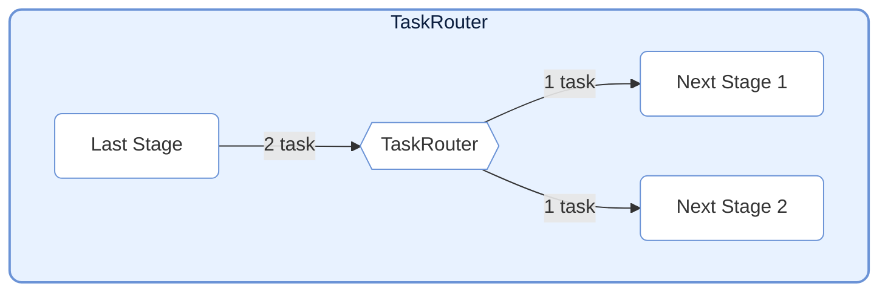

# TaskNodes

> 📅 最后更新日期: 2026/06/18

TaskNodes 模块提供了多种特殊功能的 `TaskStage` 实现，用于流控制、外部系统交互等场景。

## TaskSplitter (分裂器)


将单个输入任务分裂为多个输出任务。适用于一对多的场景。

### 初始化

```python
class TaskSplitter[TItem, RItem](TaskStage[Iterable[TItem], Iterable[RItem]]):
    def __init__(
        self,
        name: str,
        split_item: Callable[[TItem], RItem] | None = None,
        stage_mode: str = "serial",
        enable_duplicate_check: bool = True,
        log_level: str = "INFO",
    ):
        """
        初始化 TaskSplitter。

        :param name: 节点名称
        :param split_item: 自定义单个子任务处理函数，默认使用恒等映射
        :param stage_mode: 节点运行模式
        :param enable_duplicate_check: 是否启用重复检查
        :param log_level: 日志级别
        """
```

> **已变更**：`execution_mode` 固定为 `"serial"`、`max_retries` 固定为 `0`，无需也不应通过外部参数修改。此前文档提及的 `unpack_task_args=True` 参数在当前源码中不存在。

### 使用方式

```python
class MySplitter(TaskSplitter):
    def _split(self, *task):
        # 将输入数据分裂为多个部分
        return task[0], task[1]  # 返回元组，每个元素成为独立任务
```

### 特性

- **机制**: 输入一个任务，`_split` 返回元组中每个元素被包装成独立的 `TaskEnvelope` 发送给下游。
- **计数**: 内部维护 `split_counter` 统计分裂出的总任务数。
- **固定配置**: `execution_mode="serial"`, `max_retries=0`（在 `__init__` 中硬编码）。
- **split_item**: 可选的自定义子任务处理函数，对每个分裂项做预处理。

---

## TaskRouter (路由器)



根据条件将任务分发到不同的下游路径。

### 初始化

```python
class TaskRouter(TaskStage):
    def __init__(
        self,
        name: str,
        router: Callable[[T], str],
        *,
        stage_mode: str = "serial",
    ):
        """
        初始化 TaskRouter。

        :param name: 节点名称
        :param router: 路由函数，根据任务数据返回目标 stage 名称
        :param stage_mode: 节点运行模式
        """
```

### 使用方式

`TaskRouter` 不再要求上游提前构造 `(target_tag, data)` 元组，而是由自身持有的 `router(task) -> str` 函数负责决定下游：

```python
# 定义路由函数：根据任务内容返回下游节点名称
def route_logic(data: int) -> str:
    if data > 0:
        return "positive_stage"
    else:
        return "negative_stage"

# 上游只产出原始任务
source = TaskStage("Source", func=lambda x: x)

# Router 内部完成路由决策
router = TaskRouter("路由器", route_logic)

# 连接下游（返回值必须与下游 stage 名称匹配）
graph.connect([router], [pos_stage, neg_stage])
```

### 特性

- **机制**: 接收原始任务 `task`，先调用 `router(task)` 计算目标名称，再把原始 `task` 发送到对应的下游 Stage。
- **计数**: 为每个目标维护独立的计数器 `route_counters`。
- **错误处理**: 如果 `router(task)` 返回的目标名称不存在于已绑定的下游列表中，会抛出 `InvalidOptionError`。
- **固定配置**: `execution_mode="serial"`, `max_retries=0`（在 `__init__` 中硬编码）。

---

## 使用示例

### TaskSplitter：将一条记录分裂为多条

```python
from celestialflow import TaskGraph, TaskStage, TaskSplitter

# 自定义分裂器：按行分裂文本
class LineSplitter(TaskSplitter):
    def _split(self, *task):
        return tuple(task[0].split("\\n"))

# 定义后续处理阶段
source = TaskStage("Input", func=lambda x: x, stage_mode="serial")
splitter = LineSplitter("SplitLines")
processor = TaskStage("Process", func=lambda x: f">>> {x}", stage_mode="serial")

graph = TaskGraph()
graph.set_stages([source, splitter, processor])
graph.connect([source], [splitter])
graph.connect([splitter], [processor])

# 输入一条包含三行的文本，分裂为三个独立任务
text_data = "line1\\nline2\\nline3"
graph.start_graph({source.get_name(): [text_data]})
```

### TaskRouter：按条件分发任务

```python
from celestialflow import TaskGraph, TaskStage, TaskRouter

# 定义路由判断逻辑（只返回目标名称）
def classify_number(x: int) -> str:
    if x > 0:
        return "positive"
    elif x < 0:
        return "negative"
    else:
        return "zero"

# 构建图节点
source = TaskStage("Source", func=lambda x: x, stage_mode="serial")
router = TaskRouter("Router", classify_number)
handler_pos = TaskStage("positive", func=lambda x: f"Positive: {x}", stage_mode="serial")
handler_neg = TaskStage("negative", func=lambda x: f"Negative: {x}", stage_mode="serial")
handler_zero = TaskStage("zero", func=lambda x: f"Zero: {x}", stage_mode="serial")

graph = TaskGraph()
graph.set_stages([source, router, handler_pos, handler_neg, handler_zero])
graph.connect([source], [router])
graph.connect([router], [handler_pos, handler_neg, handler_zero])

graph.start_graph({source.get_name(): [10, -5, 0, 3, -1]})
```

> **注意**: `router(task)` 的返回值必须与下游 `TaskStage` 的 `name` 完全匹配。

---

## 注意事项

1. **结构型节点定位**: `TaskSplitter` 和 `TaskRouter` 改变的是图结构与下游分发语义，适合作为框架内建节点保留。
2. **自定义协议实现**: 与 Redis、消息队列、RPC 等外部系统的交互更适合由调用方用普通 `TaskStage` 自行实现。
