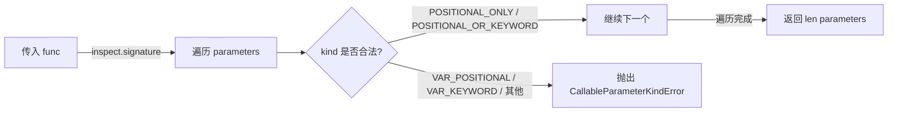

# StageCallable

> 📅 最后更新日期: 2026/06/18

`stage/util_callable.py` 提供执行器函数的签名验证工具，用于在 `TaskExecutor` 初始化时校验传入函数是否符合参数规范。

## 核心函数

### validate_executor_func_signature

```python
def validate_executor_func_signature(func: Callable[..., Any]) -> int:
    """
    验证执行器函数的参数 kind 是否符合要求，并返回参数数量。

    :param func: 执行器函数
    :return: 参数数量
    :raises CallableParameterKindError: 参数包含 *args、**kwargs 等非纯位置参数时抛出
    """
```

使用 `inspect.signature` 检查函数签名的每个参数，只允许 `POSITIONAL_ONLY` 和 `POSITIONAL_OR_KEYWORD` 两种参数类型。若检测到 `VAR_POSITIONAL`（`*args`）、`VAR_KEYWORD`（`**kwargs`）等类型，会抛出 `CallableParameterKindError`。

**验证流程：**



## 使用示例

### 在 TaskExecutor 初始化时自动调用

`validate_executor_func_signature` 在 `TaskExecutor.__init__` 中通过 `_set_func` → `validate_executor_func_signature` 的调用链自动执行：

```python
from celestialflow.stage.util_callable import validate_executor_func_signature
from celestialflow.runtime.util_errors import CallableParameterKindError


# 合法的执行器函数（纯位置参数）
def good_func(x: int, y: str) -> bool:
    return True

param_count = validate_executor_func_signature(good_func)
print(f"参数数量: {param_count}")  # 2


# 不合法的执行器函数（包含 *args）
def bad_func(*args):
    return args

try:
    validate_executor_func_signature(bad_func)
except CallableParameterKindError as e:
    print(f"签名验证失败: {e}")
```

## 注意事项

- 此函数被 `TaskExecutor._set_func()` 内部调用，用户通常不需要直接使用。
- 合法的参数 kind 包括 `POSITIONAL_ONLY`、`POSITIONAL_OR_KEYWORD`。
- 不合法的参数 kind 包括 `VAR_POSITIONAL`（`*args`）、`VAR_KEYWORD`（`**kwargs`）、`KEYWORD_ONLY` 等。
