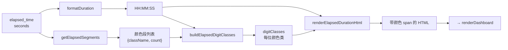

# dashboard_statuses.ts

> 📅 最后更新日期: 2026/05/24

管理各节点运行状态数据的加载、同步与仪表盘状态卡片的动态渲染。提供运行时间彩色分段渲染能力。

## 类型定义

```ts
type NodeStatus = {
  status: number;            // 0=未运行, 1=运行中, 2=已停止
  tasks_processed: number;   // 已处理任务总数
  tasks_pending: number;     // 队列中等待的任务数
  tasks_succeeded: number;   // 成功处理的任务数
  tasks_failed: number;      // 处理失败的任务数
  tasks_duplicated: number;  // 被去重过滤的任务数
  stage_mode: string;        // 节点模式（serial/thread）
  execution_mode: string;    // 运行模式（serial/thread/async）
  start_time: number;        // Unix 时间戳（秒）
  elapsed_time: number;      // 已运行秒数
  remaining_time: number;    // 预计剩余秒数
  task_avg_time: string;     // 平均每个任务耗时文本
};
```

## 全局变量

| 变量 | 类型 | 说明 |
|------|------|------|
| `nodeStatuses` | `Record<string, NodeStatus>` | 所有节点的当前状态快照 |
| `lastNodeStatuses` | `Record<string, NodeStatus>` | 上一轮状态快照，用于计算增量显示 |
| `statusRev` | `number` | 上次拉取的版本号，用于增量拉取 |
| `draggingNodeName` | `string \| null` | 当前正在拖动的节点名，防止重绘闪烁 |

## 辅助函数：运行时间彩色分段渲染

以下四个函数共同实现对 `elapsed_time` 的彩色 HTML 渲染。颜色段根据成功/失败/重复任务数的比例分配给每一位数字。

### `formatElapsedDuration(seconds, successCount, failedCount, duplicateCount)`

入口函数。调用 `formatDuration()` 获取 `HH:MM:SS` 格式文本，再通过 `getElapsedSegments()`、`buildElapsedDigitClasses()`、`renderElapsedDurationHtml()` 生成带颜色 `<span>` 的 HTML。

### `getElapsedSegments(successCount, failedCount, duplicateCount)`

生成由非零计数驱动的颜色段列表。

| CSS 类 | 统计字段 | 含义 |
|--------|---------|------|
| `elapsed-success` | `tasks_succeeded` | 成功任务 |
| `elapsed-error` | `tasks_failed` | 失败任务 |
| `elapsed-duplicate` | `tasks_duplicated` | 重复任务 |

返回仅包含 `count > 0` 的段。若全部为零，返回空数组。

### `buildElapsedDigitClasses(segments, digitCount)`

按任务状态比例为 `HH:MM:SS` 去掉冒号后的每一位数字分配颜色类。

- **段数 ≥ 位数**：直接取前 N 个段。
- **段数 < 位数**：等比例分配剩余位数给各段，再通过余数排序补齐分配误差，确保每位均有颜色类。

### `renderElapsedDurationHtml(duration, digitClasses, defaultClassName)`

将 `HH:MM:SS` 字符串的每个字符包裹在 `<span>` 中。
- 冒号 `:` 使用其左侧数字的颜色类（若无左侧数字则用 `defaultClassName`）。
- 数字字符依次使用 `digitClasses` 中的类名。

---

## 核心函数

### `loadStatuses()`

异步从 `GET /api/pull_status?known_rev=N` 拉取节点状态。

- 成功获取新数据后，会调用 `appendStatusSnapshotToHistory()` 同步更新前端本地维护的历史序列。
- 标记 `statusRev` 用于后续增量拉取。

### `initSortableDashboard()`

初始化节点卡片的拖拽排序功能（基于 Sortable.js）。移动端会自动禁用以防冲突。

### `renderDashboard()`

遍历 `nodeStatuses` 为每个节点生成状态卡片。

**卡片渲染特性：**
- **实时增量**：对比 `lastNodeStatuses` 自动计算成功/失败/等待/重复任务的增量并彩色显示。
- **状态标记**：卡片左侧边框颜色反映节点状态（绿色=运行中，灰色=已停止/未运行）。
- **运行时间彩色分段**：调用 `formatElapsedDuration()` 为 `elapsed_time` 生成基于任务成功/失败/重复比例染色的 HTML。
- **四段式进度条**：直观展示成功（绿）、错误（红）、重复（黄）、等待（灰）的比例。
- **时间预估**：显示已运行时间、预计剩余时间及平均任务耗时。
- **交互跳转**：点击卡片中的错误数，自动跳转至"错误日志"标签页并预设该节点过滤器。

## 卡片样式类

| 状态 | CSS 类 | 说明 |
|------|--------|------|
| 运行中 | `node-card status-running` | 边框加深，标记活跃 |
| 已停止 | `node-card status-stopped` | 灰色边框 |
| 未启动 | `node-card` | 初始状态 |

## 运行时间渲染流程


