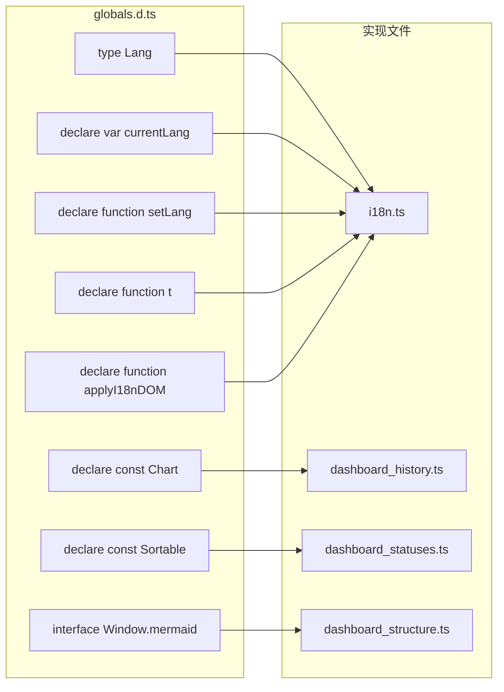

# globals.d.ts

> 📅 最后更新日期: 2026/05/24

TypeScript 全局类型声明文件，为通过 CDN `<script>` 标签引入的第三方库、全局变量以及跨模块共享函数提供声明。

## 声明内容

```ts
declare const Chart: any;         // Chart.js — 历史指标走向图
declare const Sortable: any;      // SortableJS — 节点卡片拖拽排序

interface Window {
  mermaid: any;                   // Mermaid — 任务结构图渲染
}

/** 支持的界面语言类型 */
type Lang = "zh-CN" | "en" | "ja";

/** 当前选中的语言标识 */
declare var currentLang: Lang;

/** 设置当前语言并更新 HTML 根节点的 lang 属性 */
declare function setLang(lang: Lang): void;

/** 根据翻译键获取当前语言的文本 */
declare function t(key: string, ...args: string[]): string;

/** 将国际化属性（如 data-i18n）应用到 DOM 元素 */
declare function applyI18nDOM(): void;
```

## 说明

| 声明 | 来源 | 用途 |
|------|------|------|
| `Chart` | CDN 加载的 Chart.js 库 | `dashboard_history.ts` 中的多指标折线图 |
| `Sortable` | CDN 加载的 SortableJS 库 | `dashboard_statuses.ts` 中节点卡片的自由拖拽排序 |
| `mermaid` | ESM 模块动态加载后挂载到 `window` | `dashboard_structure.ts` 中的有向图可视化 |
| `Lang` | 全局类型别名 | 语言选择下拉框的取值类型约束 |
| `currentLang` | `i18n.ts` 中定义并挂载的全局变量 | 当前激活的界面语言标识 |
| `setLang()` | `i18n.ts` | 切换语言并更新 `<html lang="...">` |
| `t()` | `i18n.ts` | 翻译函数，支持占位符替换 |
| `applyI18nDOM()` | `i18n.ts` | 遍历 DOM 中 `data-i18n` 属性并替换为当前语言的文本 |

## 类型关系



此文件确保 TypeScript 编译器能够识别非模块化加载的外部依赖以及跨模块的全局变量与函数。
