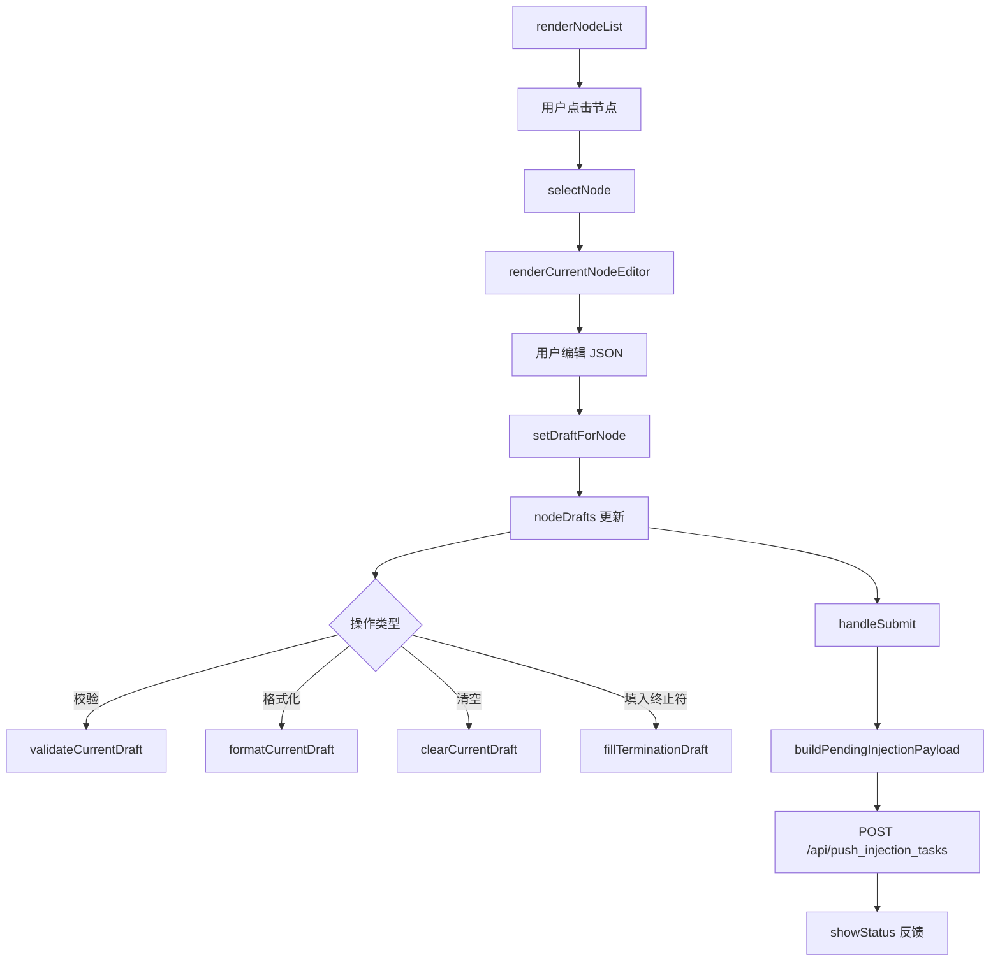

# injection.ts

> 📅 最后更新日期: 2026/06/11

管理任务手动注入页面的逻辑。采用**草稿式架构**：用户选择一个节点后编辑 JSON 草稿，编辑内容实时缓存在 `nodeDrafts` 中，最终通过"批量提交"将草稿一次性发送到后端。

> ⚠️ **已变更**: 模块经历了重大重构。旧版描述的多节点选中（`selectedNodes`）、JSON/文件输入切换（`currentInputMethod`、`uploadedFile`）等架构已替换为基于 `currentNodeName`+`nodeDrafts` 的单节点草稿系统。新增了来自错误日志页的重注入支持（`preloadInjectionDraftFromError`）。

## 类型定义

```typescript
type ValidationState = "idle" | "success" | "error" | "neutral";
```

## 全局变量

| 变量 | 类型 | 说明 |
|------|------|------|
| `currentNodeName` | `string \| null` | 当前选中的节点名；`null` 表示未选择 |
| `nodeDrafts` | `Record<string, string>` | 以节点名为键的草稿文本映射 |
| `statusHideTimer` | `ReturnType<typeof setTimeout> \| null` | 状态消息自动隐藏定时器 |

## 核心流程



## 函数

### 节点选择与列表

#### `renderNodeList(): void`
根据 `nodeStatuses` 渲染左侧可选节点列表。支持搜索过滤和"仅显示可注入节点"开关。节点状态通过 `disabled-node` 类控制不可注入节点的交互禁用。

#### `selectNode(nodeName: string): void`
切换当前选中节点。更新 `currentNodeName`，重绘节点列表高亮和右侧编辑器。

#### `isInjectableNode(nodeName: string): boolean`
判断节点是否可注入（状态为运行中 `status === 1`）。

#### `syncInjectionStateWithStatuses(): void`
当节点状态变化时同步注入页 UI 状态（如节点状态从运行中变为停止后禁用编辑器）。

---

### 编辑器

#### `renderCurrentNodeEditor(): void`
渲染右侧编辑器，包括当前节点名称、草稿状态标签（`.node-side-tag`"已编辑"）、JSON 文本域和操作按钮组。

#### `renderInjectionPage(): void`
整体刷新注入页：调用 `renderNodeList()`、`renderCurrentNodeEditor()`、`renderDraftList()` 和 `updateSubmitButtonAvailability()`。

---

### 草稿管理

#### `setDraftForNode(nodeName: string, draftText: string): void`
将文本保存到 `nodeDrafts[nodeName]`。若文本为空或与当前节点无关则删除草稿条目。更新后刷新草稿预览和提交按钮状态。

#### `getJsonTextarea(): HTMLTextAreaElement`
获取 JSON 编辑区 textarea 元素引用。

#### `getSearchInput(): HTMLInputElement`
获取节点搜索输入框引用。

#### `getInjectableOnlyToggle(): HTMLInputElement`
获取"仅显示可注入节点"开关引用。

---

### 校验与格式化

#### `validateCurrentDraft(): void`
校验当前 JSON 文本域中的草稿内容（调用 `parseDraftTaskList()`），将结果渲染到校验消息区域。

#### `formatCurrentDraft(): void`
将当前 JSON 格式化（`JSON.stringify` + `JSON.parse` 重新序列化，缩进 2 空格）并写回文本域。

#### `parseDraftTaskList(draftText: string): { ok: boolean; taskList?: unknown[]; reason?: string }`
解析草稿文本为任务列表。返回 `ok: false` 时附带 `reason` 说明失败原因。

#### `clearCurrentDraft(): void`
清空当前节点的草稿。

#### `fillTerminationDraft(): void`
在当前文本域中填入标准终止符任务模板（`[{"__celestial_termination__": true}]`）。

---

### 预览与提交

#### `renderDraftList(): void`
渲染底部草稿预览区，显示所有已有草稿的节点及其有效载荷预览。草稿解析失败时显示对应错误信息。

#### `buildPendingInjectionPayload(): { payload: Record<string, unknown[]>; invalidNode?: string; invalidReason?: string }`
构建待提交的注入载荷。遍历所有 `nodeDrafts`，解析为任务列表，汇总为 `{ nodeName: taskList[] }` 结构。任一节点解析失败时返回 `invalidNode` 和 `invalidReason`。

#### `updateSubmitButtonAvailability(): void`
根据是否有草稿来控制提交按钮的 `disabled` 状态。

#### `handleSubmit(): Promise<void>`
执行提交：调用 `buildPendingInjectionPayload()` 构建载荷，通过 `POST /api/push_injection_tasks` 发送。提交过程中按钮显示旋转指示器（`.spinner`），完成后显示结果反馈。

---

### 状态与国际化

#### `showStatus(messageKey: string, type: "success" | "error"): void`
显示提交结果状态消息（3 秒后自动隐藏）。

#### `renderStatusMessage(messageKey: string, type: "success" | "error"): string`
生成带图标的状态消息 HTML。

#### `setValidationMessage(state: ValidationState, messageKey?: string): void`
设置校验结果区的状态和文本。

#### `clearValidationMessage(): void`
清空校验结果区。

#### `setButtonLoading(loading: boolean): void`
控制提交按钮的加载状态（插入/移除 `.spinner` 元素）。

#### `refreshInjectionLocalizedText(): void`
语言切换时刷新注入页所有动态文本（校验消息、状态消息、提交按钮等）。

---

### 跨模块交互

#### `preloadInjectionDraftFromError(nodeName: string, taskData: unknown, jumpToInjectionAfterRetry?: boolean): void`
由 `errors.ts` 中重注入列调用。将任务数据合并到对应节点的草稿中（追加而非覆盖）。若 `jumpToInjectionAfterRetry` 为 `true`，自动切换到注入页签。

---

### 事件绑定

#### `setupEventListeners(): void`
初始化注入页全部交互事件（模块顶层自动执行）：
- **搜索框** (`#injection-search`): 实时过滤节点列表。
- **校验按钮** (`#btn-validate`): 触发 `validateCurrentDraft()`。
- **格式化按钮** (`#btn-format`): 触发 `formatCurrentDraft()`。
- **清空按钮** (`#btn-clear-draft`): 触发 `clearCurrentDraft()`。
- **终止符按钮** (`#btn-fill-termination`): 触发 `fillTerminationDraft()`。
- **提交按钮** (`#btn-submit-all`): 触发 `handleSubmit()`。
- **节点列表** (`#injection-node-list`): 事件委托处理节点项点击。
- **仅显示可注入** (`#injectable-only-toggle`): 触发 `renderInjectionPage()` 并保存配置。

## 使用示例

```typescript
// 模拟节点草稿数据
nodeDrafts["StageA"] = '[{"id": 1, "payload": "data1"}, {"id": 2, "payload": "data2"}]';
nodeDrafts["StageB"] = '[{"id": 3}]';

// 选择节点并渲染编辑器
// selectNode("StageA");  // 自动调用 renderCurrentNodeEditor()

// 校验当前草稿
// validateCurrentDraft();  // 结果渲染到 .validation-message

// 格式化 JSON
// formatCurrentDraft();

// 构建提交载荷
// const { payload, invalidNode, invalidReason } = buildPendingInjectionPayload();
// payload = { StageA: [{id:1,...}, {id:2,...}], StageB: [{id:3}] }

// 提交草稿
// await handleSubmit();

// 从错误页预填草稿（由 errors.ts 调用）
// preloadInjectionDraftFromError("StageA", { id: 999 }, true);
// 自动切换到注入页签并预填 task_999 到 StageA 的草稿
```

## 数据流

```mermaid
flowchart LR
    subgraph "errors.ts"
        RE[renderErrors]
        RETRY["retry-link 点击"]
    end
    subgraph "injection.ts"
        PIDE[preloadInjectionDraftFromError]
        ND[nodeDrafts]
        BPP[buildPendingInjectionPayload]
        HS[handleSubmit]
    end
    subgraph "API"
        API[POST /api/push_injection_tasks]
    end

    RETRY -->|stage, task| PIDE
    PIDE --> ND
    ND --> BPP
    BPP --> HS
    HS --> API
```
