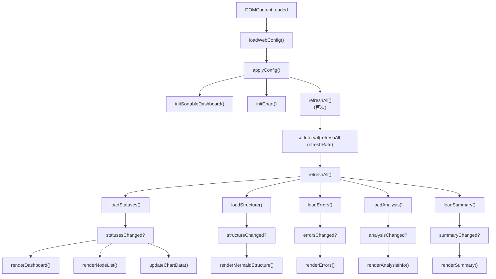

# main.ts

> 📅 最后更新日期: 2026/05/24

仪表盘主入口脚本，负责协调全局初始化、事件监听及核心数据轮询逻辑。

## 初始化流程

1. **配置加载**：调用 `loadWebConfig()` 从后端拉取持久化配置。
2. **UI 应用**：调用 `applyConfig()` 应用主题、语言、刷新间隔等设置。
3. **功能激活**：
   - `initSortableDashboard()`：开启节点卡片拖拽。
   - `initChart()`：初始化 Chart.js 历史图表。
   - ⚠️ `initHistoryMetricSwitcher()` **不在 main.ts 中调用**——它已在 `dashboard_history.ts` 的模块作用域中自动执行。
4. **轮询开启**：通过 `setInterval` 启动 `refreshAll()` 周期性刷新。

## 核心功能

### 轮询刷新 (`refreshAll`)

并行发起多个异步请求，获取最新的节点状态、图结构、错误日志、拓扑分析和汇总统计。

- **按需渲染**：仅当对应的数据版本号（`rev`）发生变化时，才触发 DOM 重新渲染。
- **状态同步**：`loadStatuses()` 成功后会自动驱动 `appendStatusSnapshotToHistory()` 累积前端历史。

### 设置交互

| 设置项 | 触发行为 |
|-------|----------|
| **刷新间隔** | 更新轮询定时器，调用 `saveWebConfig()` |
| **历史长度** | 立即调用 `trimNodeHistories()` 裁剪本地序列并重绘图表 |
| **界面语言** | 调用 `setLang()` + `applyI18nDOM()`，并全量刷新所有动态渲染的卡片 |
| **结构图增量** | 切换 `showStructureEdgeDelta` 并立即重绘 Mermaid 图 |
| **明暗主题** | 切换 body 类名，同步更新 `theme-toggle` 文案与图表主题颜色 |

### UI 辅助函数

#### `toggleDarkTheme()`
在 `body` 元素上切换 `dark-theme` 类，返回切换后的布尔状态。

#### `showSettingsSaveStatus(messageKey)`
在设置面板底部显示限时的状态提示（如"保存成功"），支持国际化 key 映射。自动在 2 秒（成功）或 5 秒（失败）后隐藏。

#### `updateSettingsStatusText()`
在语言切换后更新设置状态提示文本为当前语言的译文。

#### `isSettingsPanelOpen()` / `openSettingsPanel()` / `closeSettingsPanel()` / `toggleSettingsPanel()`
设置面板的打开/关闭/切换管理。支持：
- 点击齿轮按钮切换
- 点击关闭按钮并归还焦点
- 点击空白区域自动关闭
- 按下 `Escape` 关闭

### 焦点与辅助功能 (a11y)

- **设置面板**：支持 `Escape` 键快速关闭，关闭后焦点自动归还至设置按钮。
- **状态反馈**：设置保存时，面板底部会显示短暂的"保存成功"或"保存失败"提示（通过 `showSettingsSaveStatus()` 实现）。

## `toggleDarkTheme()` 与 `showSettingsSaveStatus()` 归属

| 函数 | 定义位置 | 用途 |
|------|---------|------|
| `toggleDarkTheme()` | **main.ts** | 主题切换 |
| `showSettingsSaveStatus()` | **main.ts** | 设置保存状态反馈 |

> 这两个函数**不在** `utils.ts` 中定义。

## 数据流向图

