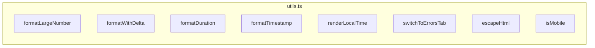

# utils.ts

> 📅 最后更新日期: 2026/05/24

包含 Web 前端通用的格式化工具、UI 辅助逻辑、DOM 操作封装及环境检测函数。

## 数值与时间格式化

### `formatLargeNumber(n)`
将大数转换为易读格式。
- `< 10,000,000`：使用千分位逗号分隔。
- `>= 10,000,000`：转换为 HTML 科学计数法（如 `~1.23×10⁹`）。

### `formatWithDelta(value, delta, deltaClass, negClass)`
格式化带有增量的数值。若增量非零，则在主数值后追加带颜色的 `+N` 或 `-N` 小字。

### `formatDuration(seconds)`
将秒数格式化为 `HH:MM:SS` 或 `MM:SS` 字符串。

### `formatTimestamp(timestamp)`
将 Unix 时间戳（秒）格式化为 `YYYY-MM-DD HH:MM:SS` 本地时间字符串。
```ts
function formatTimestamp(timestamp: number): string {
  const d = new Date(timestamp * 1000);
  // 返回格式如 "2026-05-24 14:30:00"
}
```

### `renderLocalTime(timestamp)`
将 Unix 时间戳转换为区域敏感的本地化日期时间字符串（`toLocaleString()`）。

---

## UI 与路由辅助

### `switchToErrorsTab(nodeFilter?)`
全局路由跳转函数。
- 切换当前 Tab 至"错误日志"。
- 若传入 `nodeFilter`，则自动填充错误筛选下拉框并触发一次查询。

---

## 安全与工具

### `escapeHtml(str)`
基础的 HTML 转义函数，防止动态插入文本时的 XSS 风险。转义字符：`&` `<` `>` `"` `'` `/`。

### `isMobile()`
基于 UserAgent 的简单移动端检测（匹配 `Mobi|Android|iPhone|iPad|iPod`），用于禁用拖拽排序等交互。

---

## ❌ 不属于 utils.ts 的函数

以下函数**不在** `utils.ts` 中定义，它们属于 `main.ts`：

| 函数 | 实际位置 | 说明 |
|------|---------|------|
| `toggleDarkTheme()` | **main.ts** | 明暗主题切换 |
| `showSettingsSaveStatus()` | **main.ts** | 设置保存状态提示 |

---

## 函数总览


