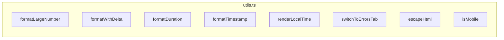

# utils.ts

> 📅 最后更新日期: 2026/05/24

包含 Web 前端通用的格式化工具、UI 辅助逻辑、DOM 操作封装及环境检测函数。

## 数值与时间格式化

### `formatLargeNumber(n)`
将大数转换为易读格式。
- `< 10,000,000`：使用千分位逗号分隔。
- `>= 10,000,000`：转换为 HTML 科学计数法（如 `~1.23×10⁹`）。

### `formatWithDelta(value, delta, deltaClass, negClass)`
格式化带有增量的数值。若增量非零，则在主数值后追加带颜色的 `+N` 或 `-N` 小字。

### `formatDuration(seconds)`
将秒数格式化为 `HH:MM:SS` 或 `MM:SS` 字符串。

### `formatTimestamp(timestamp)`
将 Unix 时间戳（秒）格式化为 `YYYY-MM-DD HH:MM:SS` 本地时间字符串。
```ts
function formatTimestamp(timestamp: number): string {
  const d = new Date(timestamp * 1000);
  // 返回格式如 "2026-05-24 14:30:00"
}
```

### `renderLocalTime(timestamp)`
将 Unix 时间戳转换为区域敏感的本地化日期时间字符串（`toLocaleString()`）。

---

## UI 与路由辅助

### `switchToErrorsTab(nodeFilter?)`
全局路由跳转函数。
- 切换当前 Tab 至"错误日志"。
- 若传入 `nodeFilter`，则自动填充错误筛选下拉框并触发一次查询。

---

## 安全与工具

### `escapeHtml(str)`
基础的 HTML 转义函数，防止动态插入文本时的 XSS 风险。转义字符：`&` `<` `>` `"` `'` `/`。

### `isMobile()`
基于 UserAgent 的简单移动端检测（匹配 `Mobi|Android|iPhone|iPad|iPod`），用于禁用拖拽排序等交互。

---

## ❌ 不属于 utils.ts 的函数

以下函数**不在** `utils.ts` 中定义，它们属于 `main.ts`：

| 函数 | 实际位置 | 说明 |
|------|---------|------|
| `toggleDarkTheme()` | **main.ts** | 明暗主题切换 |
| `showSettingsSaveStatus()` | **main.ts** | 设置保存状态提示 |

---

## 函数总览



## 使用示例

### formatLargeNumber / formatDuration / escapeHtml 等函数的使用示例

以下示例展示 `utils.ts` 中所有工具函数的用法（可在浏览器控制台直接运行）：

```typescript
// ====== 1. formatLargeNumber: 大数格式化 ======
console.log("=== formatLargeNumber ===");
console.log(formatLargeNumber(1234));        // "1,234"
console.log(formatLargeNumber(1234567));     // "1,234,567"
console.log(formatLargeNumber(9999999));     // "9,999,999"
console.log(formatLargeNumber(10000000));    // "~1.00×10⁷"
console.log(formatLargeNumber(1234567890));  // "~1.23×10⁹"

// ====== 2. formatWithDelta: 数值 + 增量显示 ======
console.log("\n=== formatWithDelta ===");
const value = 1000;
const delta = 5;
// 主数值后追加绿色 +5 小字
console.log(formatWithDelta(value, delta, "delta-positive", "delta-negative"));
// "1,000<small class="delta-positive" style="margin-left: 4px;">+5</small>"

// 负增量显示为红色
console.log(formatWithDelta(value, -3, "delta-positive", "delta-negative"));
// "1,000<small class="delta-negative" style="margin-left: 4px;">-3</small>"

// 增量为 0 时不显示增量
console.log(formatWithDelta(value, 0, "", ""));
// "1,000"

// ====== 3. formatDuration: 秒数格式化 ======
console.log("\n=== formatDuration ===");
console.log(formatDuration(0));          // "00:00"
console.log(formatDuration(45));         // "00:45"
console.log(formatDuration(120));        // "02:00"
console.log(formatDuration(3661));       // "01:01:01"
console.log(formatDuration(86399));      // "23:59:59"

// ====== 4. formatTimestamp: 时间戳格式化 ======
console.log("\n=== formatTimestamp ===");
console.log(formatTimestamp(1745400000));
// "2026-05-24 14:40:00" (取决于当前时区)

// 当前时间
console.log(formatTimestamp(Date.now() / 1000));

// ====== 5. renderLocalTime: 本地化时间 ======
console.log("\n=== renderLocalTime ===");
console.log(renderLocalTime(1745400000));
// "2026/5/24 14:40:00" (取决于浏览器区域设置)

// ====== 6. escapeHtml: HTML 转义 ======
console.log("\n=== escapeHtml ===");
const userInput = '<script>alert("xss")</script>';
console.log(escapeHtml(userInput));
// "&lt;script&gt;alert(&quot;xss&quot;)&lt;&#x2F;script&gt;"

console.log(escapeHtml('A&B < C > D'));
// "A&amp;B &lt; C &gt; D"

// ====== 7. isMobile: 移动端检测 ======
console.log("\n=== isMobile ===");
console.log(isMobile());
// 在桌面浏览器中返回 false
// 在移动设备中返回 true

// ====== 8. switchToErrorsTab: 跳转到错误页 ======
console.log("\n=== switchToErrorsTab ===");
// 跳转到错误日志标签页，不过滤节点
switchToErrorsTab();

// 跳转到错误日志标签页，并过滤特定节点
// switchToErrorsTab("StageA");
```
