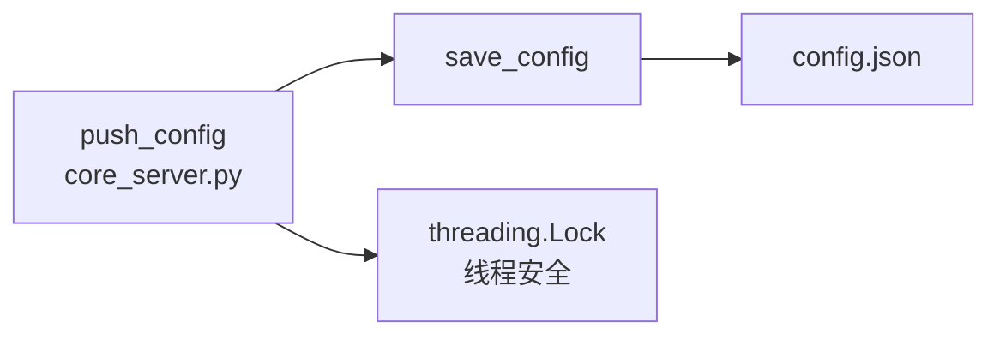

# util_config

> 📅 最后更新日期: 2026/05/24

Web 模块的配置文件读写工具，负责 `config.json` 的持久化管理。无线程锁保护——线程安全由上层调用方（`core_server.py` 的 `push_config`）保证。

## load_config

```python
def load_config(config_path: str) -> dict[str, Any]:
    """从指定路径加载并校验前端配置，返回字典。"""
```

- **文件不存在**：直接抛出 `ConfigurationError`，不会从默认模板初始化。
- 通过 `os.path.exists()` 判断文件存在性后再以 UTF-8 编码读取 JSON。

## save_config

```python
def save_config(config: dict[str, Any], config_path: str) -> bool:
    """将前端配置保存到 JSON 文件，返回是否成功。"""
```

- 以 `w` 模式写入，`indent=4`、`ensure_ascii=False` 保证可读性与中文支持。
- 无内置线程锁，多并发安全性由调用方 `core_server.py` 的 `push_config` 路由处理。
- 捕获所有 `Exception` 并在失败时打印错误信息、返回 `False`。

## 调用关系



| 函数 | 线程安全 | 异常处理 |
|------|---------|---------|
| `load_config` | 不涉及（只读） | 文件不存在 → `ConfigurationError`；JSON 解析失败 → 向上传播 |
| `save_config` | ❌ 无锁，由调用方保障 | 写入异常 → 打印错误并返回 `False` |
