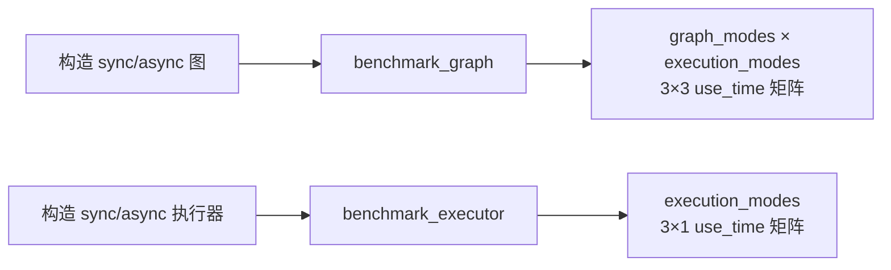

# 性能基准测试 (test_benchmark.py)

> 📅 最后更新日期: 2026/08/19

## 作用

验证 `celestialflow.benchmark.util_benchmark` 中的 `benchmark_graph` 与 `benchmark_executor` 基准函数，确保它们能在 `serial` / `thread` / `async` 三种模式下输出完整的执行时间矩阵。

## 核心测试对象

- `benchmark_graph`: 接受同步与异步两个 `TaskGraph` 实例，对两者进行 `graph_mode × execution_mode` 的 3×3 组合基准测试。
- `benchmark_executor`: 接受同步与异步两个 `TaskExecutor` 实例，对 `execution_mode` 的三种取值进行基准测试。
- `TaskGraph` / `TaskStage` / `TaskExecutor`: 用于构造最小可运行的图与执行器。

## 测试覆盖矩阵

| 测试类 | 用例 | 覆盖目标 |
|--------|------|----------|
| `TestBenchmarkGraph` | `test_benchmark_graph_covers_all_nine_combinations` | `benchmark_graph` 返回 3×3 的 graph/execution 组合矩阵 |
| `TestBenchmarkExecutor` | `test_benchmark_executor_returns_execution_modes` | `benchmark_executor` 返回统一的 `execution_modes` 列顺序 |

## 关键测试场景

### `test_benchmark_graph_covers_all_nine_combinations`

- 构造同步图 `sync_graph`（含一个 serial 模式的 `TaskStage`）与异步图 `async_graph`（`graph_mode="async"`，含一个 async 模式的 `TaskStage`）。
- 以 `{"s": [1, 2, 3]}` 作为初始任务调用 `benchmark_graph`。
- 断言：
  - 返回字典的 `graph_modes` 等于 `["serial", "thread", "async"]`。
  - `execution_modes` 等于 `["serial", "thread", "async"]`。
  - `use_time` 是 3 行 3 列的二维列表。

### `test_benchmark_executor_returns_execution_modes`

- 构造同步执行器 `sync_executor`（`execution_mode="serial"`）与异步执行器 `async_executor`（`execution_mode="async"`）。
- 以 `[1, 2, 3]` 作为任务列表调用 `benchmark_executor`。
- 断言：
  - 返回字典的 `execution_modes` 等于 `["serial", "thread", "async"]`。
  - `use_time` 是 3 行 1 列的二维列表（每个 execution_mode 一条结果）。



## 运行方式

```bash
# 全部执行
pytest tests/benchmark/test_benchmark.py -v

# 仅运行图基准测试
pytest tests/benchmark/test_benchmark.py -k "graph" -v

# 仅运行执行器基准测试
pytest tests/benchmark/test_benchmark.py -k "executor" -v
```

## 重要细节

- `benchmark_graph` 内部会按 `graph_mode` × `execution_mode` 的笛卡尔积展开为 9 个独立执行组合，并使用 `clone_graph` 复制图结构以避免相互干扰。
- `benchmark_executor` 仅在 `execution_mode` 维度上做笛卡尔积（3 种执行模式），并使用 `clone_executor` 复制执行器。
- 两个测试均通过 `pytest.mark.asyncio` 装饰为异步协程，由 `await` 触发基准循环并等待完成。

## 注意事项

- 基准测试需要 `celestialflow.benchmark` 依赖，克隆与基准工具的真实实现分别位于 `src/celestialflow/benchmark/util_clone.py` 与 `src/celestialflow/benchmark/util_benchmark.py`。
- 本文件中的测试仅校验返回矩阵的结构完整性，不对具体耗时数值做断言。
