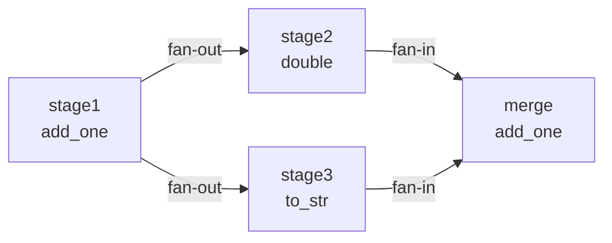

# 任务图核心功能测试 (test_graph.py)

> 最后更新日期: 2026/05/24

## 作用
全面验证 `TaskGraph` 及其各种拓扑子类（`TaskChain`、`TaskCross`、`TaskGrid`）的核心功能，涵盖同步/异步执行、错误传播、拓扑分析、执行模式矩阵、源节点推导及含环图行为。

## 核心测试对象
- `TaskGraph`: 通用任务图容器
- `TaskChain`, `TaskCross`, `TaskGrid`: 预定义拓扑结构
- `StageRuntime`: 运行时状态管理
- `TaskStage`: 图节点定义

## 测试范围

### 汇总表

| 测试类 | 用例数 | 覆盖点 |
|--------|--------|--------|
| `TestTaskGraphBasic` | 4 | 两节点 DAG、扇出、扇入、错误传播 |
| `TestTaskGraphAsync` | 5 | async 模式两节点、扇出、扇入、错误传播、async+thread stage_mode |
| `TestTaskGraphStructure` | 3 | Chain、Cross、Grid 结构 |
| `TestTaskGraphAnalysis` | 2 | DAG 检测、层级计算 |
| `TestTaskGraphSummary` | 1 | 摘要统计 |
| `TestStageExecutionMatrix` | 6 | serial/thread stage_mode × serial/thread/async execution_mode |
| `TestTaskGraphThread` | 6 | thread 模式两节点、扇出、扇入、错误传播、lambda、staged 调度 |
| `TestSourceStages` | 5 | 线性图 source、扇入 source、菱形图 source、单源 SCC 代表点、多源 SCC 各返回一点 |
| `TestCyclicGraph` | 2 | 含环图 isDAG 检测、环内同层 + 尾巴层级 |
| **合计** | **34** | |

> **说明**: 此处统计的是 `test_graph.py` 中的测试类。`TaskLoop` 和 `TaskWheel` 的专用测试在 `test_structure.py`。

### 关键测试流程

#### 基础拓扑执行


- **两节点 DAG** (`test_graph_dag_two_nodes`): 验证 A→B 数据流正确，两节点各成功 3 个。
- **扇出** (`test_graph_fan_out`): 一个上游分发到多个下游，sink_a 和 sink_b 各成功 2 个。
- **扇入** (`test_graph_fan_in`): 多个上游汇聚到一个下游，merge 节点收到 4 个任务。
- **错误传播** (`test_graph_error_propagation`): 验证 `50` 触发 `ValueError` 不阻断流程，下游仅接收成功任务。

#### 异步与并发
- async 模式下的两节点、扇出、扇入、错误传播与同步模式语义一致。
- `test_graph_async_thread_stage_mode`: 验证 `stage_mode="thread"` + `execution_mode="async"` 组合。

#### 执行模式矩阵 (`TestStageExecutionMatrix`)
覆盖 `stage_mode` × `execution_mode` 全部 **6 种组合**：

| 用例 | stage_mode | execution_mode |
|------|-----------|----------------|
| `test_serial_serial` | serial | serial |
| `test_serial_thread` | serial | thread |
| `test_serial_async` | serial | async |
| `test_thread_serial` | thread | serial |
| `test_thread_thread` | thread | thread |
| `test_thread_async` | thread | async |

每个用例使用 5 个输入任务的两节点 DAG，各验证两 stage 各成功 5 个。

#### 图结构分析 (`TestTaskGraphAnalysis`)
- **DAG 检测** (`test_dag_detection`): `isDAG` 标记应正确反映图是否有环。
- **层级计算** (`test_layer_computation`): 线性链 A→B→C 的拓扑层级为 {A:0, B:1, C:2}。

#### 复杂结构 (`TestTaskGraphStructure`)
| 结构 | 节点数 | 线程数 | 覆盖场景 |
|------|--------|--------|---------|
| Chain | 3 链式 | 3 | 线性流水线 |
| Cross | 2×3 网格 | 4 | 全连接交叉 |
| Grid | 2×2 网格 | 4 | 网格状连接 |

#### 线程模式 (`TestTaskGraphThread`)
验证 `stage_mode="thread"` 下的 fan-out、fan-in、错误传播、lambda 函数支持及 staged 调度。

#### 源节点推导 (`TestSourceStages`)
5 个用例覆盖以下场景：

| 用例 | 拓扑 | 预期 result |
|------|------|-------------|
| `test_source_stages_linear` | A→B→C | [A] |
| `test_source_stages_fan_in` | A→C, B→C | [A, B] |
| `test_source_stages_diamond` | A→{B,C}→D | [A] |
| `test_source_stages_cycle_returns_one_source_scc_member` | s1→s2→s3→s1 | 1 个环内代表点 |
| `test_source_stages_returns_one_member_per_source_scc` | 两个不相交环汇聚到 s5 | 每个源 SCC 各 1 个代表点 |

#### 含环图 (`TestCyclicGraph`)
| 用例 | 验证点 |
|------|--------|
| `test_cyclic_isDAG_false` | s1→s2→s3→s1 的 `isDAG` 应为 `False` |
| `test_cyclic_layers` | 环内节点 (s1,s2,s3) 同层，尾巴 s4 在环层级 + 1 |

### 摘要统计 (`TestTaskGraphSummary`)
验证 `collect_runtime_snapshot()` 能正确统计各节点的成功、失败、待处理任务数。
**注意**: 单元测试中未启用 `TaskReporter`，需手动调用 `collect_runtime_snapshot()`。

## 重要细节

### 终止信号行为
- 含环图使用 `put_termination_signal=True` 以确保测试退出。
- 非 DAG 图在 eager 模式下会触发 `RuntimeWarning`，测试调整为宽松断言（`>= 1`）。

### 统计快照
`get_graph_summary()` 返回的是上一次 `collect_runtime_snapshot()` 的快照数据。在未启用 `TaskReporter` 的测试中必须手动调用。

### Lambda 支持
线程模式下可使用 lambda 作为任务函数（`test_graph_thread_with_lambda`）。

## 依赖

| 依赖 | 说明 |
|------|------|
| `pytest` | 测试框架 |
| `celestialflow` | `TaskGraph`, `TaskChain`, `TaskCross`, `TaskGrid`, `TaskStage` |

## 运行方式

```bash
# 全部执行
pytest tests/graph/test_graph.py -v

# 仅结构测试（最耗时，含多线程）
pytest tests/graph/test_graph.py::TestTaskGraphStructure -v

# 仅分析测试（最快，无任务执行）
pytest tests/graph/test_graph.py::TestTaskGraphAnalysis -v
```

## 性能参考

| 测试 | 耗时（Windows / i5） |
|------|---------------------|
| `TestTaskGraphBasic` | ~2s |
| `TestTaskGraphAsync` | ~3s |
| `TestTaskGraphStructure` | ~5s |
| `TestTaskGraphAnalysis` | ~1s |
| `TestTaskGraphSummary` | ~1s |
| `TestStageExecutionMatrix` | ~5s |
| `TestTaskGraphThread` | ~4s |
| `TestSourceStages` | ~2s |
| `TestCyclicGraph` | ~2s |

## 相关文件

- `src/celestialflow/graph/core_graph.py`: `TaskGraph` 实现
- `src/celestialflow/graph/core_structure.py`: 图结构子类
- `tests/demo_structure.py`: 更复杂的图结构演示（含循环图、多层网络）
