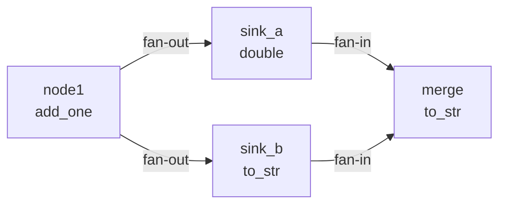

# tests/graph/test_graph.py

> 📅 最后更新日期: 2026/09/24

## 作用
全面验证 `TaskGraph` 及其各种拓扑子类（`TaskChain`、`TaskCross`、`TaskGrid`）的核心功能，涵盖同步/异步/线程执行、错误传播、SQLite 回放、运行时快照计数、拓扑分析、执行模式矩阵、源节点推导（含 SCC）与含环图行为。

## 核心测试对象
- `TaskGraph`: 通用任务图容器
- `TaskChain`, `TaskCross`, `TaskGrid`: 预定义拓扑结构
- `TaskExecutor`: 图节点定义

## 测试范围

### 汇总表

| 测试类 | 用例数 | 覆盖点 |
|--------|--------|--------|
| `TestTaskGraphBasic` | 10 | set_ctree 更新已有节点、未知节点名称查找异常、两节点 DAG、扇出、扇入、错误传播、DB 回放、DB 错误类型过滤回放、DB 保留 pending 记录、finish 后统一抛出异常组 |
| `TestTaskGraphSnapshotCounts` | 3 | fan-in 上游计数、fan-out 下游计数、快照推导 `tasks_processed`/`tasks_pending` |
| `TestTaskGraphAsync` | 6 | async 模式两节点、扇出、扇入、错误传播、async execution_mode、async finish 后统一抛出异常组 |
| `TestTaskGraphStructure` | 3 | Chain、Cross、Grid 结构 |
| `TestTaskGraphAnalysis` | 5 | 节点元信息、getter 按需构建分析、结构变更后自动重建缓存、DAG 检测、层级计算 |
| `TestNodeExecutionMatrix` | 7 | serial/thread/async graph_mode × serial/thread/async execution_mode |
| `TestTaskGraphThread` | 6 | thread 模式两节点、扇出、扇入、错误传播、lambda、线性链调度 |
| `TestSourceNodes` | 5 | 线性图 source、扇入 source、菱形图 source、单源 SCC 代表点、多源 SCC 各返回一点 |
| `TestCyclicGraph` | 3 | serial 模式含环图抛错、含环图 isDAG 检测、环内同层 + 尾巴层级 |
| **合计** | **48** | |

> **说明**: 此处统计的是 `test_graph.py` 中的测试类。`TaskLoop` 和 `TaskWheel` 的专用测试在 `test_structure.py`。

### 关键测试流程

#### 基础拓扑执行

```mermaid
graph LR
    A[node1<br/>add_one] -->|fan-out| B[sink_a<br/>double]
    A -->|fan-out| C[sink_b<br/>to_str]
    B -->|fan-in| D[merge<br/>to_str]
    C -->|fan-in| D
```

- **两节点 DAG** (`test_graph_dag_two_nodes`): 验证 A→B 数据流正确，两节点各成功 3 个。
- **扇出** (`test_graph_fan_out`): 一个上游分发到多个下游，`sink_a` 和 `sink_b` 各成功 2 个。
- **扇入** (`test_graph_fan_in`): 多个上游汇聚到一个下游，merge 节点收到 4 个任务。
- **错误传播** (`test_graph_error_propagation`): 验证 `50` 触发 `ValueError` 不阻断流程，下游仅接收成功任务（node1 成功 2 / 失败 1，node2 成功 2 / 失败 0）。
- **DB 回放** (`test_graph_restore_db`): `restore_db` 默认读取 `failed` 与 `pending` 记录并按节点名分组回放。
- **DB 错误类型过滤** (`test_graph_restore_db_filters_error_type_when_enabled`): `restore_db(..., statuses=["failed"], filter_by_error_type=True)` 按各节点的 `retry_exceptions` 过滤 `error_type`。
- **DB 保留 pending 记录** (`test_graph_restore_db_filter_keeps_pending_records`): 过滤开启时 `pending` 记录仍继续回放。
- **未知节点名称异常** (`test_graph_node_lookup_unknown_node_raises`): 显式按节点注入任务时，不存在的节点名称应抛出 `NodeNotFoundError`。
- **set_ctree 更新已有节点** (`test_set_ctree_updates_existing_nodes`): 先 `set_nodes` 再 `set_ctree` 时，已有节点也应共享同一事件客户端。
- **finish 后统一抛出异常组** (`test_start_raises_exception_group_after_finish`): 同步 `start` 在 `_finish_start` 后统一抛出收集到的 `ExceptionGroup`。

#### 快照边计数 (`TestTaskGraphSnapshotCounts`)
- `test_fan_in_upstream_counts`: fan-in 节点的 `get_snapshot()["upstream_counts"]` 记录每个上游提供的任务数量，上游节点的 `downstream_counts` 对应一致。
- `test_fan_out_downstream_counts`: fan-out 节点的 `downstream_counts` 记录发往每个下游的数量。
- `test_snapshot_restores_processed_and_pending`: 快照层推导 `tasks_processed` / `tasks_pending` / `tasks_succeeded`。

#### 异步与并发 (`TestTaskGraphAsync`)
- async 模式下的两节点、扇出、扇入、错误传播与同步模式语义一致。
- `test_graph_async_execution_mode`: 验证 `graph_mode="async"` + `execution_mode="async"` 组合。
- `test_start_async_raises_exception_group_after_finish`: 异步 `start_async` 在 finish 后统一抛出异常组。

#### 执行模式矩阵 (`TestNodeExecutionMatrix`)
覆盖 `graph_mode` × `execution_mode` 全部 **7 种组合**：

| 用例 | graph_mode | execution_mode |
|------|-----------|----------------|
| `test_serial_serial` | serial | serial |
| `test_serial_thread` | serial | thread |
| `test_thread_serial` | thread | serial |
| `test_thread_thread` | thread | thread |
| `test_async_serial` | async | serial |
| `test_async_thread` | async | thread |
| `test_async_async` | async | async |

每个用例使用 5 个输入任务的两节点 DAG，各验证两节点各成功 5 个。

#### 图结构分析 (`TestTaskGraphAnalysis`)
- **节点元信息** (`test_get_node_meta_covers_all_nodes`): `get_node_meta()` 为每个节点给出 `class_name`、`execution_mode` 等构建期元信息。
- **按需构建** (`test_getters_build_analysis_on_demand`): 分析与结构 getter（`get_graph_analysis`、`get_nodes`、`get_edges`、`get_structure_list`、`get_source_nodes`）在未显式 build 时也应可直接使用。
- **自动重建缓存** (`test_getters_refresh_analysis_after_connect`): `connect` 后 getter 应自动重建分析缓存，源节点与层级随之更新。
- **DAG 检测** (`test_dag_detection`): `isDAG` 标记应正确反映图是否有环。
- **层级计算** (`test_layer_computation`): 线性链 A→B→C 的拓扑层级为 {A:0, B:1, C:2}。

#### 复杂结构 (`TestTaskGraphStructure`)
| 结构 | 节点数 | 覆盖场景 |
|------|--------|---------|
| Chain | 3 链式 | 线性流水线，各节点成功 2 个 |
| Cross | 2×3 分层全连接 | 每个 layer2 节点收到来自 2 个 layer1 节点的各 1 个结果 |
| Grid | 2×2 网格 | 左上根处理 2 个任务，其余节点按传递累计 |

#### 线程模式 (`TestTaskGraphThread`)
验证 `graph_mode="thread"` 下的两节点串行、fan-out、fan-in、错误传播、lambda 函数支持及线性链调度。

#### 源节点推导 (`TestSourceNodes`)
5 个用例覆盖以下场景：

| 用例 | 拓扑 | 预期结果 |
|------|------|-------------|
| `test_source_nodes_linear` | A→B→C | `[A]` |
| `test_source_nodes_fan_in` | A→C, B→C | `{A, B}` |
| `test_source_nodes_diamond` | A→{B,C}→D | `[A]` |
| `test_source_nodes_cycle_returns_one_source_scc_member` | s1→s2→s3→s1 | 1 个环内代表点 |
| `test_source_nodes_returns_one_member_per_source_scc` | 两个不相交环汇聚到 s5 | 每个源 SCC 各 1 个代表点 |

#### 含环图 (`TestCyclicGraph`)
| 用例 | 验证点 |
|------|--------|
| `test_cyclic_serial_graph_raises` | serial graph_mode 下调用 `get_source_nodes()` 时含环图应抛出 `ConfigurationError`（匹配 `"TaskGraph contains a cycle while graph_mode='serial'"`） |
| `test_cyclic_is_dag_false` | s1→s2→s3→s1 的 `isDAG` 应为 `False` |
| `test_cyclic_layers` | 环内节点 (s1,s2,s3) 同层，尾巴 s4 在环层级 + 1 |

## 重要细节

### 终止信号行为
- 含环图通过 `run()` 启动并注入任务（`run` 默认 `if_put_signal=True`，自动为源节点补发终止信号）以确保测试退出。
- serial graph_mode 下含环图调用 `get_source_nodes()` 时会触发 `ConfigurationError`（见 `test_cyclic_serial_graph_raises`）。

### 数据库回放
- `restore_db(db_path, statuses=None, *, filter_by_error_type=False, if_put_signal=True)`：`statuses` 默认 `["failed", "pending"]`；`filter_by_error_type` 为关键字参数，开启后按节点 `metrics.get_retry_error_type_names()` 过滤 `error_type`，但 `pending` 记录始终保留。

### Lambda 支持
线程模式下可使用 lambda 作为任务函数（`test_graph_thread_with_lambda`）。

## 依赖

| 依赖 | 说明 |
|------|------|
| `pytest` | 测试框架 |
| `celestialflow` | `TaskGraph`, `TaskChain`, `TaskCross`, `TaskGrid`, `TaskExecutor` |
| `celestialflow.persistence.util_sqlite` | `append_records`（DB 回放用例写入测试记录） |
| `celestialflow.runtime.util_errors` | `ConfigurationError`, `NodeNotFoundError` |
| `celestialflow.runtime.util_event` | `LocalEventClient`（`set_ctree` 用例） |

## 运行方式

```bash
# 全部执行
pytest tests/graph/test_graph.py -v

# 仅结构测试（含多线程）
pytest tests/graph/test_graph.py::TestTaskGraphStructure -v

# 仅分析测试（最快，无任务执行）
pytest tests/graph/test_graph.py::TestTaskGraphAnalysis -v

# 仅快照计数测试
pytest tests/graph/test_graph.py::TestTaskGraphSnapshotCounts -v
```

## 性能参考

| 测试 | 耗时 |
|------|------|
| `TestTaskGraphBasic` | ~2s |
| `TestTaskGraphSnapshotCounts` | < 0.5s |
| `TestTaskGraphAsync` | ~3s |
| `TestTaskGraphStructure` | ~5s |
| `TestTaskGraphAnalysis` | ~1s |
| `TestNodeExecutionMatrix` | ~5s |
| `TestTaskGraphThread` | ~4s |
| `TestSourceNodes` | ~2s |
| `TestCyclicGraph` | ~2s |

## 相关文件

- `src/celestialflow/graph/core_graph.py`: `TaskGraph` 实现
- `src/celestialflow/graph/core_structure.py`: 图结构子类
- `tests/graph/test_structure.py`: TaskLoop / TaskWheel 专用测试
