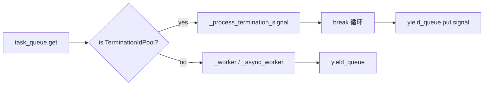

# tests/node/test_dispatch.py

> 📅 最后更新日期: 2026/09/24

## 作用

验证 `celestialflow.node.core_dispatch.TaskDispatch` 在 `serial` / `thread` / `async` 三种调度模式下的核心行为：任务正常执行、异常重试（成功 / 耗尽）、终止信号合并退出，以及失败 / 重试处理链自身崩溃时的兜底逻辑。

## 核心测试对象

| 类 / 函数 | 角色 | 说明 |
|-----------|------|------|
| `TaskDispatch` | 被测类 | 任务调度器，从 `task_queue` 拉取 `TaskEnvelope` / `TerminationIdPool`，按模式执行后把终止信号写回 `yield_queue` |
| `TaskExecutor` | 宿主 | 构造最小可运行的执行器用作调度宿主 |
| `_CtreeStub` / `_SequentialCtreeStub` | Mock | 替换 `ctree_client.emit` 为递增整数，避免与 sqlite 唯一约束冲突 |
| `get_log_spout()` / `get_lifecycle_spout()` | 全局句柄 | 在 `autouse` fixture `_cleanup_global_spouts` 中于用例前后 `stop()`，避免后台线程与持久化状态串扰 |
| `_RecordingLogInlet` / `_CrashRetryLogInlet` | 模拟 LogInlet | 记录 `worker_crash` 或让 `task_retry` 抛异常，以触发处理链崩溃兜底 |
| `_CrashOnFailObserver` | 模拟 Observer | `on_task_fail` 内抛异常，验证 `observer_error` 兜底 |
| `_make_executor` / `_put` / `_put_termination` / `_collect_results` / `_run_dispatch` | 工具函数 | 构造执行器、注入任务 / 终止信号、收集结果、按模式运行调度器 |

## 关键测试场景

### `TestDispatchSerial` — 串行调度

| 用例 | 覆盖目标 |
|------|---------|
| `test_single_task` | 串行模式处理单个任务，结果为 9 |
| `test_multiple_tasks` | 串行模式处理 5 个任务，结果数量 + 终止信号 = 6 |
| `test_retry_then_succeed` | 前 2 次抛 `ValueError`、第 3 次成功；最终 `func.calls == 3` |
| `test_retry_exhausted` | 持续抛错时仅输出终止信号 |
| `test_termination_single_id` | 单个终止 ID 能正确传递到结果队列 |
| `test_termination_multi_id` | 多个终止 ID 合并后只输出 1 个终止信号 |
| `test_success_fanout_creates_distinct_downstream_ids` | 成功扇出时为每个真实下游生成独立 `TaskEnvelope.get_id()`，且持久化的 `get_success_pairs()` 能读回结果 |

### `TestDispatchThread` — 线程调度

| 用例 | 覆盖目标 |
|------|---------|
| `test_basic_parallel` | 10 任务、4 线程并行处理，结果数 = 10 |

### `TestDispatchAsync` — 异步调度

| 用例 | 覆盖目标 |
|------|---------|
| `test_basic_async` | 10 任务、4 协程并发，结果数 = 10 |
| `test_async_retry_then_succeed` | 异步重试：前 2 次抛错、第 3 次成功，`func.calls == 3` |

### `TestWorkerCrashKeepsTerminationSignal` — Worker 崩溃兜底（参数化覆盖三种模式）

| 用例 | 覆盖目标 |
|------|---------|
| `test_fail_handler_crash_keeps_termination` | observer 失败回调内抛 `RuntimeError`，由 `observer_error` 兜底，**不**触发 `worker_crash`，终止信号照常发出 |
| `test_retry_handler_crash_keeps_termination` | `LogInlet.task_retry` 抛异常时，调度不中断、终止信号照常发出，且 `worker_crash` 记录到该异常 |

### `TestDispatchCoreBehavior` — 跨模式参数化

| 用例 | 覆盖目标 |
|------|---------|
| `test_empty_queue_with_termination` | 空队列 + 终止信号时三种模式都能正常退出 |
| `test_result_count` | 5 任务在三种模式下结果数都为 5（不含终止信号） |

## 关键数据流



## 测试覆盖矩阵

| 测试类 | 用例数 | 覆盖目标 |
|--------|--------|---------|
| `TestDispatchSerial` | 7 | 单/多任务、重试成功、重试耗尽、单/多 ID 终止信号、成功扇出独立下游 ID |
| `TestDispatchThread` | 1 | 10 任务并发 |
| `TestDispatchAsync` | 2 | 10 任务并发、异步重试成功 |
| `TestWorkerCrashKeepsTerminationSignal` | 2 | 失败处理链崩溃、重试日志崩溃（参数化 3 种模式 → 6 用例） |
| `TestDispatchCoreBehavior` | 2 | 空队列退出、5 任务结果数（参数化 3 种模式 → 6 用例） |
| **合计** | **14**（参数化展开后 22） | |

## 运行方式

```bash
# 全部执行
pytest tests/node/test_dispatch.py -v

# 仅运行串行调度测试
pytest tests/node/test_dispatch.py -k "Serial" -v

# 仅运行线程调度测试
pytest tests/node/test_dispatch.py -k "Thread" -v

# 仅运行异步调度测试
pytest tests/node/test_dispatch.py -k "Async" -v

# 仅运行 worker 崩溃兜底测试
pytest tests/node/test_dispatch.py -k "Crash" -v

# 仅运行跨模式参数化测试
pytest tests/node/test_dispatch.py -k "CoreBehavior" -v
```

## 性能参考

| 测试类 | 耗时 |
|--------|------|
| `TestDispatchSerial` | < 0.5s |
| `TestDispatchThread` | < 0.5s |
| `TestDispatchAsync` | < 0.5s |
| `TestWorkerCrashKeepsTerminationSignal` | < 1.0s（6 用例 = 2 场景 × 3 模式） |
| `TestDispatchCoreBehavior` | < 1.0s（6 用例 = 2 场景 × 3 模式） |

## 注意事项

- 每个用例都有 `autouse` fixture `_cleanup_global_spouts`，确保 `LogSpout` / `LifecycleSpout` 在用例前后各 `stop()` 一次，避免后台线程泄漏或持久化状态串扰。
- `_CtreeStub` 起始 ID 默认为 42，避免与 sqlite 唯一约束冲突；`test_success_fanout_creates_distinct_downstream_ids` 另用 `_SequentialCtreeStub`（起始 100）以区分每个下游的 ID。
- 通过公开 API（`task_queue.put` / `yield_queue.add_queue`）注入测试夹具，避免直接修改 `executor` 内部状态；`metrics.set_downstream_counter` 与 `yield_queue.add_queue` 成对绑定，模拟 `connect_to` 的行为。
- `_RecordingLogInlet` 的 `_log` 是空操作，避免依赖真实 spout 队列。
- `monkeypatch.setattr` 替换 `get_log_inlet` 时需同时覆盖 `celestialflow.node.core_node` 与 `celestialflow.node.core_dispatch` 两处，因为两边都会调用。
- 相关实现位于 `src/celestialflow/node/core_dispatch.py` 与 `src/celestialflow/node/core_node.py`。
