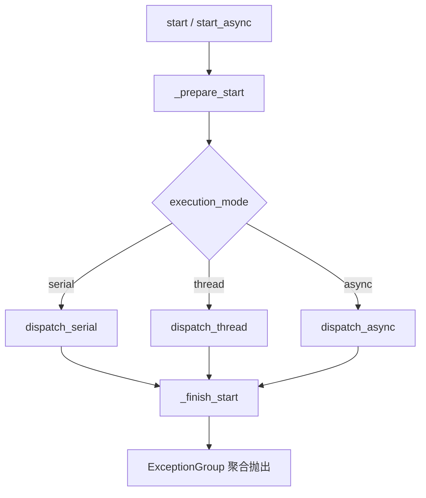

# tests/node/test_node.py

> 📅 最后更新日期: 2026/10/09

## 作用

验证 `celestialflow.node.core_node.BaseTaskNode`（通过公共子类 `TaskExecutor` 间接覆盖）提供的通用配置、绑定与启动异常聚合行为，包括节点唯一标识、执行模式校验、可重试异常配置、`get_meta()` 构建期字段划分，以及 `connect_to` 建立的队列绑定在切换执行模式后仍稳定。

## 核心测试对象

| 类 / 函数 | 角色 | 说明 |
|-----------|------|------|
| `add_one(x)` | 测试回调 | 同步加一函数 |
| `async_add_one(x)` | 测试回调 | 异步加一协程函数 |
| `TestBaseTaskNodeConfig` | 用例类 | 覆盖名称、执行模式、可重试异常、元信息、切换模式时下游绑定不丢失 |
| `TestBaseTaskNodeStartErrors` | 用例类 | 覆盖 `start` / `start_async` 异常聚合行为 |

## 关键测试场景

### `TestBaseTaskNodeConfig` — 配置与绑定

| 用例 | 覆盖目标 |
|------|---------|
| `test_node_name_identity` | 节点名称直接来自构造参数 `name` |
| `test_node_name_changes_with_name` | 通过 `set_name(...)` 修改名称后 `get_name()` 同步更新 |
| `test_valid_execution_mode_serial` | 支持 `execution_mode="serial"` |
| `test_valid_execution_mode_thread` | 支持 `execution_mode="thread"` |
| `test_valid_execution_mode_async` | 支持 `execution_mode="async"`（使用 `async_add_one`） |
| `test_invalid_execution_mode` | 非法模式应抛 `InvalidOptionError` |
| `test_default_retry_exceptions_empty` | 默认可重试异常为空（`retry_exceptions == ()`，`get_retry_error_type_names() == set()`） |
| `test_set_retry_exceptions_is_additive` | `set_retry_exceptions(...)` 累积异常类型并映射为类型名集合 |
| `test_get_meta_reports_build_time_fields` | `get_meta()` 只返回 `class_name` / `execution_mode` / `max_workers` |
| `test_connect_to_binding_survives_execution_mode_switch` | `connect_to` 建立的下游 / 上游队列绑定在 `set_execution_mode("thread")` 后仍保持稳定 |

### `TestBaseTaskNodeStartErrors` — 启动异常聚合

| 用例 | 覆盖目标 |
|------|---------|
| `test_start_raises_exception_group_after_finish` | 通过 `monkeypatch` 让 `_prepare_start` 抛 `ValueError("prepare failed")`、`_finish_start` 返回 `[RuntimeError("finish failed")]`；同步 `start()` 最终抛 `ExceptionGroup`，其中两条异常按"prepare → finish"顺序 |
| `test_start_async_raises_exception_group_after_finish` | 异步版本同样把 prepare 异常与 finish 异常聚合成 `ExceptionGroup` 抛出 |

## 关键数据流


```mermaid
flowchart TB
    Start[start / start_async]
    Prep[_prepare_start]
    Mode{execution_mode}
    Serial[dispatch_serial]
    Thread[dispatch_thread]
    Async[dispatch_async]
    Finish[_finish_start]
    Agg[ExceptionGroup 聚合抛出]

    Start --> Prep
    Prep --> Mode
    Mode -- serial --> Serial
    Mode -- thread --> Thread
    Mode -- async --> Async
    Serial --> Finish
    Thread --> Finish
    Async --> Finish
    Finish --> Agg
```

## 测试覆盖矩阵

| 测试类 | 用例数 | 覆盖目标 |
|--------|--------|---------|
| `TestBaseTaskNodeConfig` | 10 | 名称标识与修改、三种合法执行模式、非法模式报错、可重试异常默认与累积、元信息字段划分、切换模式不破坏下游绑定 |
| `TestBaseTaskNodeStartErrors` | 2 | 同步 / 异步 `start*` 异常聚合 |
| **合计** | **12** | |

## 运行方式

```bash
# 全部执行
pytest tests/node/test_node.py -v

# 仅运行配置相关用例
pytest tests/node/test_node.py -k "Config" -v

# 仅运行启动异常聚合用例
pytest tests/node/test_node.py -k "StartErrors" -v

# 仅运行执行模式相关用例
pytest tests/node/test_node.py -k "execution_mode" -v
```

## 性能参考

| 测试类 | 耗时 |
|--------|------|
| `TestBaseTaskNodeConfig` | < 0.5s |
| `TestBaseTaskNodeStartErrors` | < 0.5s |

## 注意事项

- `test_connect_to_binding_survives_execution_mode_switch` 是回归测试：`connect_to` 建立的下游队列池 `yield_queue` 与上游输入源 `source_names` 在切换执行模式后保持稳定，不因重建调度器而丢失绑定。
- `get_meta()` 只返回构建期元信息（`class_name` / `execution_mode` / `max_workers`），供图结构一次性上报使用。
- `TestBaseTaskNodeStartErrors` 通过 `monkeypatch.setattr` 替换 `_prepare_start` 与 `_finish_start` 两个**内部钩子**，验证同步 / 异步启动时异常都被聚合为 `ExceptionGroup` 抛出。
- `ExceptionGroup` 仅在 Python 3.11+ 可用，本仓库基于 Python 3.14 满足要求。
- 相关实现位于 `src/celestialflow/node/core_node.py`。