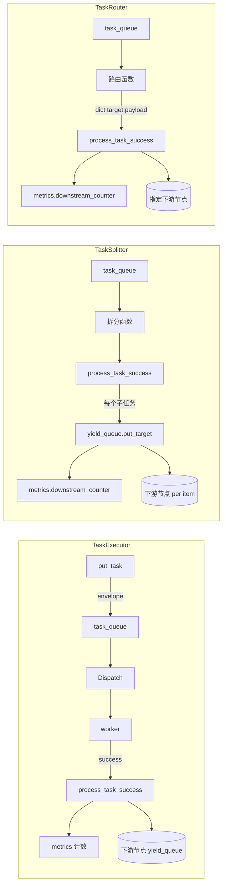

# tests/node/test_nodes.py

> 📅 最后更新日期: 2026/09/24

## 作用

验证 `celestialflow.node.core_nodes` 中三个具体节点类 `TaskExecutor` / `TaskSplitter` / `TaskRouter` 的执行、拆分、路由行为，覆盖串行 / 线程 / 异步三种执行模式、从 sqlite 持久化回放、节点初始化约束、路由未知目标报错以及绑定计数器的稳定锁。

## 核心测试对象

| 类 / 函数 | 角色 | 说明 |
|-----------|------|------|
| `TaskExecutor` | 被测类 | 通用执行器，验证 `serial` / `thread` / `async`、异常处理、retry、restore_db、结果持久化 |
| `TaskSplitter` | 被测类 | 1→N 拆分器，验证 `metrics.downstream_counter`、空可迭代、生成器、自定义拆分函数 |
| `TaskRouter` | 被测类 | 路由器，`func` 返回 `dict[str, Y]` 映射；验证 `metrics.downstream_counter`、未知 target 抛 `InvalidOptionError`、稳定锁 |
| `append_records` | 工具 | 通过 `celestialflow.persistence.util_sqlite` 直接写入失败 / pending 记录用于回放测试 |
| `build_result_dict` | 工具 | 聚合 `get_success_pairs` 与 `get_error_pairs` 为 `{task: result_or_error_str}` |

## 关键测试场景

### `TestTaskExecutor` — 执行器（14 用例）

| 用例 | 覆盖目标 |
|------|---------|
| `test_serial_basic` | 串行执行 5 个任务，succeeded=5、failed=0、pending=0 |
| `test_serial_with_errors` | 串行执行 `[1,-1,2,-2,3]`，`PersistedError.error_type == "ValueError"`，succeeded=3 / failed=2 |
| `test_serial_retry` | 注册 `RuntimeError` 为可重试；前 2 次抛错后第 3 次返回 `x+100`，`call_count == 3` |
| `test_serial_no_retry_for_unmatched_exception` | 未注册的异常不会触发重试，直接 failed |
| `test_thread_basic` | 线程模式（4 worker）成功处理 5 任务 |
| `test_async_basic` | 异步模式成功处理 3 任务 |
| `test_async_double` | 异步模式连续处理 20 任务 |
| `test_restore_db` | 默认只读本节点 `stage == self.get_name()` 的 failed / pending，回放 3 条成功 |
| `test_restore_db_filters_error_type_when_enabled` | `filter_by_error_type=True` + `set_retry_exceptions(RuntimeError)` 时只回放 RuntimeError |
| `test_restore_db_filter_keeps_pending_records` | 开启过滤时 `pending` 记录始终保留 |
| `test_success_persist` | 成功结果写入 `LifecycleSpout` 缓存，`get_success_pairs()` 能读回 |
| `test_rejects_zero_argument_func` | 0 参函数应抛 `ConfigurationError` |
| `test_rejects_multi_argument_func` | 多参函数应抛 `ConfigurationError` |
| `test_name_and_execution_mode` | `get_name()` 与 `execution_mode` 暴露正确 |

### `TestTaskSplitter` — 拆分器（5 用例）

| 用例 | 覆盖目标 |
|------|---------|
| `test_splitter_init` | 默认 `execution_mode="serial"`、`metrics.downstream_counter == {}` |
| `test_splitter_process_success` | `TaskGraph` 串联后下游 `tasks_succeeded == 3`、`downstream_counter["A"].get() == 3` |
| `test_splitter_allows_empty_iterable` | 空可迭代不抛异常，下游 succeeded=0、发送计数=0 |
| `test_splitter_supports_generator_input` | 一次性生成器也能被完整拆分（发送计数=3） |
| `test_splitter_custom_func_transforms_items` | 自定义拆分函数（`lambda task: (item.strip() for item in task)`）对子任务做变换后再分发，下游结果为 `["a", "b", "c"]` |

### `TestTaskRouter` — 路由器（6 用例）

| 用例 | 覆盖目标 |
|------|---------|
| `test_router_init` | 默认 `serial`、`metrics.downstream_counter == {}` |
| `test_router_func_returns_target_payload_map` | `func(task)` 返回 `{target: payload}` 映射 |
| `test_router_process_success` | `TaskGraph` 中两个下游 `target1` / `target2` 各收 1 条，`downstream_counter` 各自 = 1 |
| `test_router_unknown_target_fails_with_hint` | 已连接目标正常送达；未连接目标计入失败，错误信息含 `Unknown target: ghost` 与允许目标列表 |
| `test_router_dispatch_targets_receive_own_payload` | 一次路由返回多个目标时，各下游收到各自的载荷而非路由器输入 |
| `test_router_binding_counter_stable_across_mode_switch` | 路由计数器从创建就绑定 `metrics`，切换 `execution_mode` 后同一计数器对象不变 |

## 关键数据流



## 测试覆盖矩阵

| 测试类 | 用例数 | 覆盖目标 |
|--------|--------|---------|
| `TestTaskExecutor` | 14 | 三种执行模式、retry 命中/不命中、sqlite 回放（含按 error_type 过滤）、持久化、回调签名校验 |
| `TestTaskSplitter` | 5 | 默认参数、图集成、空可迭代、生成器、自定义拆分函数 |
| `TestTaskRouter` | 6 | 默认参数、`func` 返回映射、图集成、未知 target 报错、按载荷分发、稳定锁 |
| **合计** | **25** | |

## 运行方式

```bash
# 全部执行
pytest tests/node/test_nodes.py -v

# 仅运行 TaskExecutor 测试
pytest tests/node/test_nodes.py -k "TaskExecutor" -v

# 仅运行 TaskSplitter 测试
pytest tests/node/test_nodes.py -k "TaskSplitter" -v

# 仅运行 TaskRouter 测试
pytest tests/node/test_nodes.py -k "TaskRouter" -v

# 仅运行 sqlite 回放用例
pytest tests/node/test_nodes.py -k "restore_db" -v
```

## 性能参考

| 测试类 | 耗时 |
|--------|------|
| `TestTaskExecutor` | < 2.0s（含 sqlite 持久化与回放） |
| `TestTaskSplitter` | < 1.0s |
| `TestTaskRouter` | < 1.0s |

## 注意事项

- `test_restore_db*` 用例通过 `append_records` 直接写入 sqlite，验证 `load_tasks_grouped_by_stage` 的回放逻辑；记录中的 `stage` 字段为节点名称（与 `TaskGraph` 中 `set_nodes` 一致）。
- `test_router_unknown_target_fails_with_hint` 断言 `TaskRouter.process_task_success` 对未通过 `connect_to` 绑定的目标抛出 `InvalidOptionError`，且错误信息包含 `Unknown target: <name>` 与当前允许的目标列表。
- `test_router_binding_counter_stable_across_mode_switch` 是回归测试，覆盖绑定计数器之前在不同模式下因 `TaskMetrics` 重建而失去引用的问题；现版本 `connect_to` 让上下游共享同一计数器对象。
- 异步用例需 `pytest-asyncio` 插件（项目已配置 `pytest.mark.asyncio`）。
- 持久化相关用例依赖全局 `LifecycleSpout` / `LogSpout`；如需隔离，建议在自定义 fixture 中显式 `start()` / `stop()`。
- 相关实现位于 `src/celestialflow/node/core_nodes.py`。
