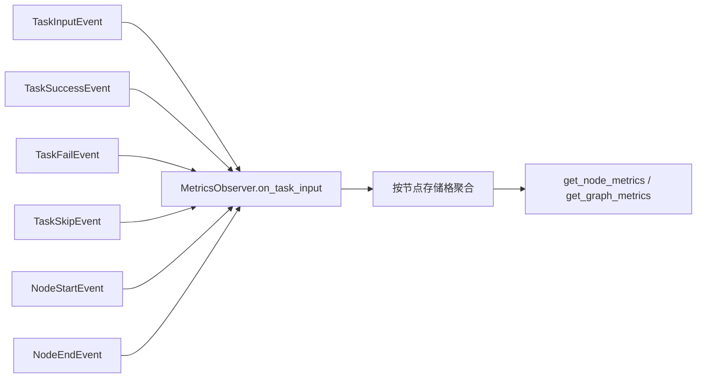

# tests/observer/test_metrics.py

> 📅 最后更新日期: 2026/10/09

## 作用

验证 `celestialflow.observer.MetricsObserver` 的事件驱动指标聚合逻辑：外部 / 上游输入计数、成功 / 失败 / 跳过计数、节点运行状态维护，以及按节点隔离的图级指标视图。重构后 `MetricsObserver` 取代了旧有 `core_report` 上报逻辑，作为指标观察者随事件更新。

## 核心测试对象

| 类 / 函数 | 来源 | 说明 |
|-----------|------|------|
| `MetricsObserver` | `celestialflow.observer` | 指标观察者，消费 `NodeStartEvent` / `NodeEndEvent` / `TaskInputEvent` / `TaskSuccessEvent` / `TaskFailEvent` / `TaskSkipEvent` 事件并聚合指标 |
| `get_node_metrics(name)` | MetricsObserver | 返回单节点指标；未登记节点返回 `None` |
| `get_graph_metrics()` | MetricsObserver | 返回所有已登记节点的指标快照映射 |
| `NodeStatus` | `celestialflow.runtime.util_types` | 节点状态枚举（`RUNNING` / `STOPPED`） |
| `_external_input` / `_upstream_input` | 工具函数 | 构造外部输入 / 上游投递的 `TaskInputEvent` |

## 测试覆盖矩阵

### `TestMetricsObserverStorage` — 存储与读取

| 用例 | 覆盖目标 |
|------|---------|
| `test_unknown_node_returns_none` | 未登记节点的 `get_node_metrics("ghost")` 返回 `None` |

### `TestMetricsObserverEvents` — 事件聚合

| 用例 | 覆盖目标 |
|------|---------|
| `test_external_input_counted` | 外部输入只增加接收方计数：`external_input == 1`、`input_total == 1` |
| `test_upstream_input_updates_both_sides` | 上游投递同时写接收方上游计数 `upstream_counts` 与来源方下游计数 `downstream_counts` |
| `test_success_fail_skip_counts` | 成功 / 失败 / 跳过事件分别写入 `succeeded` / `failed` / `skipped`，`processed` 为三者之和 |
| `test_node_status_transitions` | `on_node_start` 置状态为 `RUNNING` 且 `start_time > 0`；`on_node_end` 置状态为 `STOPPED` |

### `TestMetricsObserverGraphView` — 图级视图

| 用例 | 覆盖目标 |
|------|---------|
| `test_cells_are_isolated_between_nodes` | 不同节点的存储格互不影响：仅被操作节点的 `succeeded` 变化 |
| `test_graph_metrics_covers_all_registered_nodes` | `get_graph_metrics()` 覆盖所有已登记节点（`{"a", "b"}`） |

## 关键数据流



> 指标按节点隔离存储；`downstream_counts` / `upstream_counts` 记录节点间实际的数据投递方向与次数。

## 运行方式

```bash
# 全部执行
pytest tests/observer/test_metrics.py -v

# 仅运行存储 / 读取测试
pytest tests/observer/test_metrics.py -k "Storage" -v

# 仅运行事件聚合测试
pytest tests/observer/test_metrics.py -k "Events" -v

# 仅运行图级视图测试
pytest tests/observer/test_metrics.py -k "GraphView" -v
```

## 注意事项

- `MetricsObserver` 以纯事件驱动方式更新指标，测试直接调用 `on_*` 事件方法模拟生命周期，无需运行实际任务图。
- 上游投递一方面写接收方（`upstream_counts` / `upstream_input`），另一方面写来源方（`downstream_counts`），两者在同一事件内完成。
- 相关实现位于 `src/celestialflow/observer/core_metrics.py`。