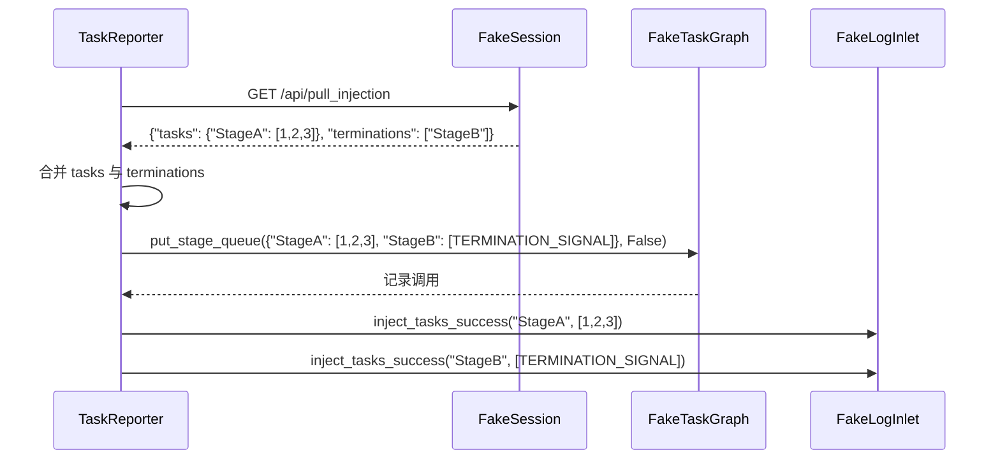

# Reporter 注入与上报测试 (test_reporter_injection.py)

> 📅 最后更新日期: 2026/06/28

## 作用

验证 `celestialflow.observability.core_report` 中 `TaskReporter` 的任务注入与错误推送逻辑：Reporter 从远端拉取拆分后的任务与终止符载荷后，能否正确合并并注入到图队列；同时验证错误推送的端点选择、去重与增量推送行为。

## 核心测试对象

| 类 | 类型 | 说明 |
|----|------|------|
| `FakeResponse` / `FakePostResponse` | Mock | 模拟 HTTP GET/POST 响应 |
| `FakeSession` / `FakePushSession` | Mock | 模拟 `requests.Session` 的 GET/POST 方法并记录调用 |
| `FakeTaskGraph` / `FakeErrorGraph` | Mock | 模拟图注入接口与错误查询接口 |
| `FakeLogInlet` | Mock | 记录注入成功/失败、拉取失败、推送失败日志 |
| `TaskReporter` | 被测类 | `celestialflow.observability` 中的注入与上报器 |

## 关键测试场景

### `test_reporter_accepts_split_task_and_termination_payload`

**覆盖目标**：验证 `TaskReporter._pull_injection()` 能消费服务端返回的拆分载荷 `{"tasks": {...}, "terminations": [...]}`，并将任务与终止符一并注入图队列。

**断言意图**：

- `graph.put_stage_queue` 被调用一次，参数为合并后的任务字典（终止符节点映射到 `TERMINATION_SIGNAL` 单例），且 `put_termination_signal=False`。
- `log_inlet.inject_tasks_success` 分别记录 StageA 的任务注入和 StageB 的终止符注入。
- 无失败日志（`failures`、`pull_failures` 均为空）。



### `test_reporter_merges_tasks_and_termination_for_same_stage`

**覆盖目标**：同一节点同时出现在 `tasks` 与 `terminations` 中时，应保留任务列表并在末尾追加终止符，而不是互相覆盖。

**断言意图**：

- `graph.put_stage_queue` 被调用一次，StageA 的任务列表为 `[1, 2, 3, TERMINATION_SIGNAL]`。
- `log_inlet.successes` 仅包含一条 StageA 注入记录。

### `test_reporter_pushes_errors_via_push_errors_endpoint_only`

**覆盖目标**：验证 `TaskReporter._push_errors()` 只通过 `/api/push_errors` 端点推送错误（不再使用旧的 `/api/push_errors_meta`）。

- 写入一条 sqlite 错误记录。
- 设置 `_server_has_current_graph = False`（触发全量推送）。
- 断言 POST 目标 URL 末尾为 `/api/push_errors`。
- 断言 payload 包含 `graph_id` 和 `errors` 字段，错误记录字段与 sqlite 记录一致。

### `test_reporter_pushes_only_errors_after_server_max_event_id`

**覆盖目标**：验证 Reporter 只推送 failed 记录中 `event_id` 大于服务端水位线的记录。

- 写入 3 条错误记录（`event_id=1,5,7`）。
- 设置 `_server_has_current_graph = True`、`_server_max_event_id_in_fail = 3`。
- 断言仅推送 `event_id` 为 5 和 7 的记录。

## 测试覆盖矩阵

| 测试函数 | 覆盖目标 |
|----------|----------|
| `test_reporter_accepts_split_task_and_termination_payload` | 拆分载荷解析、任务与终止符合并注入、注入成功日志 |
| `test_reporter_merges_tasks_and_termination_for_same_stage` | 同节点任务与终止符的合并规则 |
| `test_reporter_pushes_errors_via_push_errors_endpoint_only` | 错误推送端点统一为 `/api/push_errors`、全量推送 payload 结构 |
| `test_reporter_pushes_only_errors_after_server_max_event_id` | 基于服务端水位线的增量错误推送 |

## 运行方式

```bash
# 执行全部注入与上报测试
pytest tests/observability/test_reporter_injection.py -v

# 仅运行注入载荷解析测试
pytest tests/observability/test_reporter_injection.py -k "accepts_split" -v

# 仅运行合并规则测试
pytest tests/observability/test_reporter_injection.py -k "merges" -v

# 仅运行错误推送测试
pytest tests/observability/test_reporter_injection.py -k "push_errors" -v
```

## 注意事项

- 测试使用 Fake 对象完全隔离网络依赖，`TaskReporter` 的实际 HTTP 行为在其他测试中验证。
- 任务载荷与终止符在远端已拆分，Reporter 端负责重新合并并替换终止符为 `TERMINATION_SIGNAL` 单例。
- `FakePushSession` 会记录每次 POST 的 URL、JSON payload 与 timeout，便于断言推送内容而不依赖真实网络。
- 相关实现位于 `src/celestialflow/observability/core_report.py`。
