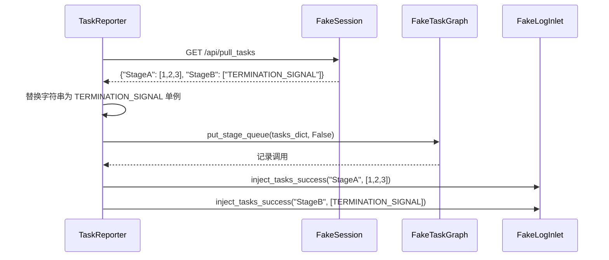

# 注入器测试 (test_reporter_injection.py)

> 📅 最后更新日期: 2026/06/11

## 作用

验证 `TaskReporter` 的任务注入机制——Reporter 从远端拉取 `{node_name: [tasklist]}` 格式的映射后，能否正确注入到图队列并记录注入日志。

## 核心测试对象

| 类 | 类型 | 说明 |
|----|------|------|
| `FakeResponse` / `FakePostResponse` | Mock | 模拟 HTTP 响应 |
| `FakeSession` / `FakePushSession` | Mock | 模拟 `requests.Session` 的 GET/POST 方法 |
| `FakeTaskGraph` / `FakeErrorGraph` | Mock | 模拟图注入与错误查询接口 |
| `FakeLogInlet` | Mock | 记录注入成功/失败和推送事件的日志 |
| `TaskReporter` | 被测类 | `celestialflow.observability` 中的注入与上报器 |

## 关键测试场景

### test_reporter_accepts_node_to_tasklist_mapping

**覆盖目标**：验证 `TaskReporter._pull_and_inject_tasks()` 能正确处理 `{StageA: [1, 2, 3], StageB: [TERMINATION_SIGNAL]}` 格式的映射，并一次性注入整包任务。

**断言意图**：

- `graph.put_stage_queue` 被调用一次，参数为合并后的任务字典（终止信号被替换为 `TERMINATION_SIGNAL` 单例），且 `put_termination_signal=False`。
- `log_inlet.inject_tasks_success` 被调用两次，分别记录 StageA 和 StageB 的注入成功。
- 无失败日志（`failures` 和 `pull_failures` 均为空）。



## 运行方式

```bash
# 执行全部注入测试
pytest tests/observability/test_reporter_injection.py -v

# 仅运行节点映射注入测试
pytest tests/observability/test_reporter_injection.py -k "node_to_tasklist" -v

# 仅运行错误推送测试
pytest tests/observability/test_reporter_injection.py -k "push_errors" -v
```

## 其他关键测试

### test_reporter_pushes_errors_via_push_errors_endpoint_only

**覆盖目标**：验证 `TaskReporter._push_errors()` 只通过 `/api/push_errors` 端点推送错误（不再使用旧的 `/api/push_errors_meta`）。

- 写入一条 sqlite 错误记录
- 设置 `_server_has_current_graph = False`（触发全量推送）
- 断言 POST 目标 URL 末尾为 `/api/push_errors`
- 断言 payload 包含 `graph_id` 和 `errors` 字段

### test_reporter_pushes_only_errors_after_server_max_event_id

**覆盖目标**：验证 Reporter 只推送 event_id 大于服务端水位线的失败记录。

- 写入 3 条错误记录（event_id=1,5,7）
- 设置 `_server_max_event_id_in_fail = 3`
- 断言仅推送 event_id 为 5 和 7 的记录

## 注意事项

- 测试使用 Fake 对象完全隔离网络依赖，`TaskReporter` 的实际 HTTP 行为在其他测试中验证。
- `TERMINATION_SIGNAL` 字符串在注入时会被替换为全局单例对象，这是核心逻辑——测试通过 `assert graph.calls` 验证此替换行为。
- `FakeResponse` 和 `FakeSession` 是轻量 Mock，不依赖 `unittest.mock` 或 `responses` 库。
