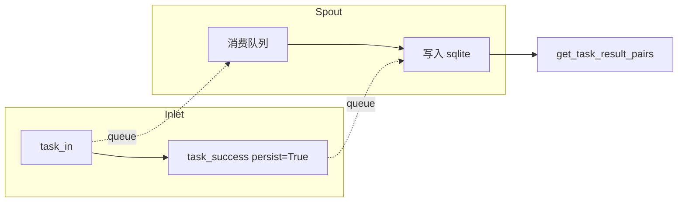

# 容错持久化测试 (test_fallback.py)

> 📅 最后更新日期: 2026/06/18

## 作用

验证 `celestialflow.persistence.core_fallback` 中的 `FallbackInlet` 与 `FallbackSpout` 配对组件，确保任务错误与成功结果能够通过后台线程写入 sqlite 数据库，并可按 stage 维度读取 task-error 对和 task-result 对。

## 核心测试对象

- `FallbackInlet`: 通过 `task_in()` / `task_retry()` / `task_fail()` / `task_success()` / `task_duplicate()` 等方法将生命周期事件入队。
- `FallbackSpout`: 后台线程消费队列中的事件，落盘到 sqlite 文件，并支持 `get_task_error_pairs()` / `get_task_result_pairs()` 查询。

## 测试覆盖矩阵

| 测试类 | 用例数 | 覆盖目标 |
|--------|--------|---------|
| `TestFailPersistence` | 2 | 完整生命周期持久化、成功结果持久化 |

## 关键测试场景

### `test_fallback_lifecycle_persistence`

覆盖 `task_in` → `task_retry` → `task_fail` 和 `task_in` → `task_success` → `task_duplicate` 的完整持久化链路。

- 验证 sqlite 文件创建（`.sqlite3` 后缀）
- 验证 `get_task_error_pairs("s1")` 返回正确 task-error 对
- 直接查询 records 表，验证 `event_id`、`stage`、`status`、`error_type`、`error_message`、`task_json`、`result_json` 字段完全匹配预期
- 重试产生的中间 event_id 不会出现在最终记录中（仅保留最终的 `failed` 状态）

### `test_success_persistence`

覆盖任务成功后调用 `persist=True` 的场景。

- 验证 `get_task_result_pairs("s1")` 返回 `(task, result)` 元组列表
- 验证多次 success 的读取顺序与写入顺序一致



## 运行方式

```bash
# 全部执行
pytest tests/persistence/test_fallback.py -v

# 按关键字匹配
pytest tests/persistence/test_fallback.py -k "lifecycle" -v
pytest tests/persistence/test_fallback.py -k "success" -v
```

## 注意事项

- 测试通过 `monkeypatch.chdir(tmp_path)` 将工作目录切换到临时目录，sqlite 文件在测试结束后自动清理。
- 与旧版 `FailInlet`/`FailSpout`（JSONL 格式）不同，当前实现使用 sqlite 存储，由 `util_sqlite` 模块管理。
- 相关实现在 `src/celestialflow/persistence/core_fallback.py`。
