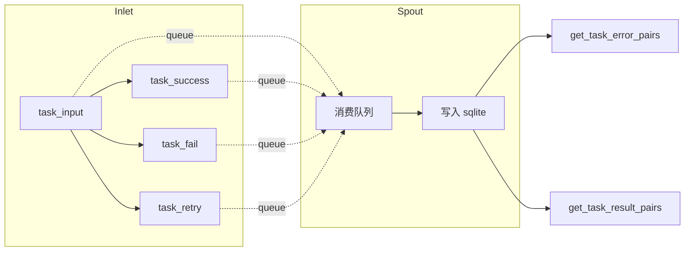

# tests/persistence/test_lifecycle.py

> 📅 最后更新日期: 2026/09/24

## 作用

验证 `celestialflow.persistence.core_lifecycle` 中的 `LifecycleInlet` 与 `LifecycleSpout` 配对组件，确保任务生命周期事件（`task_input` / `task_success` / `task_fail` / `task_retry`）通过后台线程写入 sqlite 文件，并可按 stage 维度读取 task-error 对和 task-result 对；同时验证重试次数持久化与旧库自动补列。

## 核心测试对象

- `LifecycleInlet`: 通过 `task_input()` / `task_success()` / `task_fail()` / `task_retry()` 将生命周期事件经 `_funnel()` 投递到内部队列。
- `LifecycleSpout`: 后台线程消费队列中的事件并落盘到 sqlite 文件，支持 `get_task_error_pairs()` / `get_task_result_pairs()` 查询。
- `connect_db`（`celestialflow.persistence.util_sqlite`）: 建立连接并负责表结构升级（如为旧库补 `retry_times` 列）。

## 测试覆盖矩阵

| 测试类 | 用例数 | 覆盖目标 |
|--------|--------|---------|
| `TestLifecyclePersistence` | 4 | 完整生命周期持久化、成功结果持久化、重试次数持久化、旧库补列 |

## 关键测试场景

### `test_lifecycle_persistence`

覆盖 `task_input` → `task_fail` 与 `task_input` → `task_success` 两条生命周期链路（s1 / s2 两个 stage）。

- `task_input(stage_name, event_id, task)` 向 `LifecycleInlet` 注入一条 pending 记录。
- `task_fail(event_id=1, error_id=21, error=ValueError("oops"))` 将 s1 的 pending 记录晋升为 failed，最终记录以 `error_id`（21）作为落库 `event_id`，并绑定错误类型与错误消息。
- `task_success(event_id=2, result="ok2")` 将 s2 的 pending 记录晋升为 success，保留原 `event_id`（2）并写入结果。
- 断言 sqlite 文件创建成功（`./lifecycles/<日期>/flow_lifecycle(<时间>).sqlite3`），`get_task_error_pairs("s1")` 返回 `[("data1", ("ValueError", "oops"))]`。
- 直接查询 records 表并按 `id` 排序，验证 `event_id` 序列为 `[21, 2]`，逐字段核对 `stage` / `status` / `error_type` / `error_message` / `task_json` / `result_json`，且两条记录的 `ts` 均大于 0。

### `test_success_persistence`

覆盖成功结果的持久化与回读。

- 对 s1、s2 分别执行 `task_input` + `task_success`（结果 100 / 200）。
- 断言 `get_task_result_pairs("s1")` 返回 `[("task1", 100)]`，即 task-result 对按 stage 准确读回。

### `test_retry_persistence`

覆盖重试次数的持久化与最终晋升。

- 对 s1：`task_input` → 两次 `task_retry` → `task_success`，断言晋升 success 时清空错误信息、保留 `retry_times == 2`。
- 对 s2：`task_input` → 两次 `task_retry` → `task_fail(error_id=22)`，断言 failed 记录保留最新错误信息（`ValueError` / `final boom`）且 `retry_times == 2`。
- 断言 records 表中 `(event_id, status, retry_times)` 为 `[(1, "success", 2), (22, "failed", 2)]`。

### `test_old_db_gets_retry_times_column`

覆盖旧库结构升级。

- 手工创建一个不含 `retry_times` 列的 `records` 表。
- 调用 `connect_db(db_path)` 后，通过 `PRAGMA table_info(records)` 断言 `retry_times` 列已被自动补齐。



## 运行方式

```bash
# 全部执行
pytest tests/persistence/test_lifecycle.py -v

# 按关键字匹配
pytest tests/persistence/test_lifecycle.py -k "lifecycle" -v
pytest tests/persistence/test_lifecycle.py -k "success" -v
pytest tests/persistence/test_lifecycle.py -k "retry" -v
```

## 注意事项

- 测试通过 `monkeypatch.chdir(tmp_path)` 将工作目录切换到临时目录，sqlite 文件（`./lifecycles/<日期>/flow_lifecycle(<时间>).sqlite3`）在测试结束后自动清理。
- 失败记录的 `event_id` 会被替换为 `task_fail()` 传入的 `error_id`，与该 stage 后续的错误查询/推送语义保持一致。
- `LifecycleInlet` 与 `LifecycleSpout` 是两个测试隔离的本地实例，**不**使用 `get_lifecycle_inlet()` / `get_lifecycle_spout()` 全局单例，避免污染其它测试。
- 相关实现在 `src/celestialflow/persistence/core_lifecycle.py`。
