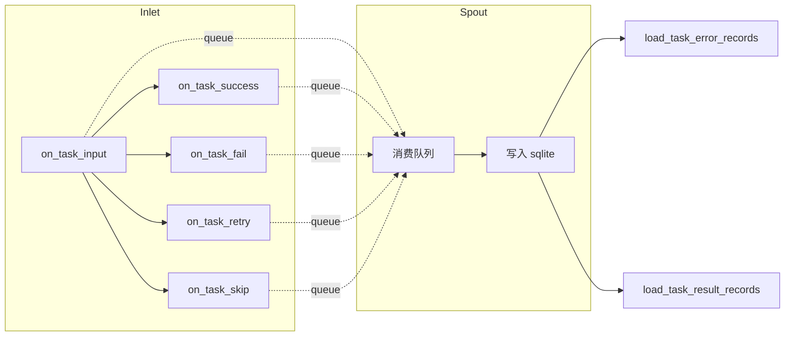

# tests/persist/test_lifecycle.py

> 📅 最后更新日期: 2026/10/09

## 作用

验证 `celestialflow.persist.core_lifecycle` 中的 `LifecycleInlet` 与 `LifecycleSpout` 配对组件，确保任务生命周期事件（`on_task_input` / `on_task_success` / `on_task_fail` / `on_task_retry` / `on_task_skip`）通过后台线程写入 sqlite 文件，并可按节点读取 task-error 对和 task-result 对；同时验证重试次数持久化与旧库自动补列。

## 核心测试对象

| 类 / 对象 | 来源 | 说明 |
|-----------|------|------|
| `LifecycleInlet` | `celestialflow.persist.core_lifecycle` | 将生命周期事件经 `bind_spout` 投递到内部队列 |
| `LifecycleSpout` | `celestialflow.persist.core_lifecycle` | 后台线程消费队列中的事件并落盘到 sqlite 文件，`db_path` 指向生成的数据库 |
| `load_task_error_records` / `load_task_result_records` | `celestialflow.persist.util_sqlite` | 按节点读取 task-error / task-result 对 |
| `connect_db` | `celestialflow.persist.util_sqlite` | 建立连接并负责表结构升级（如为旧库补 `retry_times` 列） |
| 事件类型 | `celestialflow.observer` | `TaskInputEvent` / `TaskSuccessEvent` / `TaskFailEvent` / `TaskRetryEvent` / `TaskSkipEvent` |

## 测试覆盖矩阵

| 测试类 | 用例数 | 覆盖目标 |
|--------|--------|---------|
| `TestLifecyclePersistence` | 5 | 完整生命周期持久化、成功结果持久化、重试次数持久化、跳过持久化、旧库补列 |

## 关键测试场景

### `test_lifecycle_persistence`

覆盖 `on_task_input` → `on_task_fail` 与 `on_task_input` → `on_task_success` 两条生命周期链路（s1 / s2 两个节点）。

- `on_task_input` 向 `LifecycleInlet` 注入 pending 记录。
- `on_task_fail` 将 s1 的 pending 记录晋升为 failed，最终记录以失败事件携带的 `event_id`（21）作为落库 ID，并绑定错误类型与错误消息。
- `on_task_success` 将 s2 的 pending 记录晋升为 success，保留原 `event_id`（2）并写入结果。
- 断言 `.sqlite3` 文件创建成功，`load_task_error_records(db_path, "s1")` 返回 `[("data1", ("ValueError", "oops"))]`。
- 直接查询 `records` 表并按 `id` 排序，验证 `event_id` 序列为 `[21, 2]`（`node` / `status` / `error_type` / `error_message` / `task_json` / `result_json` 逐字段核对），且两条记录的 `ts` 均大于 0。

### `test_success_persistence`

覆盖成功结果的持久化与回读。

- 对 s1、s2 分别执行 `on_task_input` + `on_task_success`（结果 100 / 200）。
- 断言 `load_task_result_records(db_path, "s1")` 返回 `[("task1", 100)]`。

### `test_retry_persistence`

覆盖重试次数的持久化与最终晋升。

- 对 s1：`on_task_input` → 两次 `on_task_retry` → `on_task_success`，断言晋升 success 时清空错误信息、保留 `retry_times == 2`。
- 对 s2：`on_task_input` → 两次 `on_task_retry` → `on_task_fail`，断言 failed 记录保留最新错误信息（`ValueError` / `final boom`）且 `retry_times == 2`。
- 断言 `records` 表中 `(event_id, status, retry_times)` 为 `[(1, "success", 2), (22, "failed", 2)]`。

### `test_skip_persistence`

覆盖跳过持久化。

- 对 s1 执行 `on_task_input` + `on_task_skip`，`on_task_skip` 将 pending 晋升为 `skipped` 并切换到跳过事件携带的 `event_id`（31）。

### `test_old_db_gets_retry_times_column`

覆盖旧库结构升级。

- 手工创建一个不含 `retry_times` 列的 `records` 表。
- 调用 `connect_db(db_path)` 后，通过 `PRAGMA table_info(records)` 断言 `retry_times` 列已被自动补齐。


```mermaid
flowchart LR
    subgraph Inlet
        A[on_task_input] --> B[on_task_success]
        A --> C[on_task_fail]
        A --> D[on_task_retry]
        A --> E[on_task_skip]
    end
    subgraph Spout
        F[消费队列] --> G[写入 sqlite]
    end
    A -.->|queue| F
    B -.->|queue| F
    C -.->|queue| F
    D -.->|queue| F
    E -.->|queue| F
    G --> H[load_task_error_records]
    G --> I[load_task_result_records]
```

## 运行方式

```bash
# 全部执行
pytest tests/persist/test_lifecycle.py -v

# 按关键字匹配
pytest tests/persist/test_lifecycle.py -k "lifecycle" -v
pytest tests/persist/test_lifecycle.py -k "success" -v
pytest tests/persist/test_lifecycle.py -k "retry" -v
pytest tests/persist/test_lifecycle.py -k "skip" -v
```

## 注意事项

- 测试通过 `monkeypatch.chdir(tmp_path)` 将工作目录切换到临时目录，sqlite 文件在测试结束后自动清理。
- 失败 / 跳过记录的落库 `event_id` 会被替换为最终状态事件携带的事件 ID（失败事件 ID / 跳过事件 ID），保持后续错误查询 / 推送语义一致。
- `LifecycleInlet` 与 `LifecycleSpout` 是两个测试隔离的本地实例，不依赖全局单例，避免污染其它测试。
- 相关实现在 `src/celestialflow/persist/core_lifecycle.py`。